# <span style="color: #6bc06bff;">Report settimanale –Tirocinio PicoSaTs</span>

Questo documento raccoglie, settimana per settimana, i punti chiave dai paper analizzati, con focus su misure Near-Field (NF) e trasformazione Far-Field (FF), e sulla loro integrazione con il beamforming di antenne AESA.

---

## <span style="color: #e69a44ff;">Settimana 1</span>

Focus: sistemi di misura in camera anecoica e metodi NF→FF, con attenzione al planar scanning.

- Obiettivo
  - Comprendere il flusso di misura NF planare e la trasformazione al FF.
  - Identificare requisiti di campionamento, correzione di sonda e principali fonti di errore.

- Setup di misura in camera anecoica (planar scanning)
  - AUT su supporto fisso; piano di scansione X–Y a distanza costante `z0`.
  - Sonda ricevente a polarizzazione nota, montata su traslatore X–Y con controllo fine.

- Trasformazione NF→FF planare (spettro di onde piane)
  - Si misura il campo tangenziale su griglia rettangolare: `E(x,y,z0)`.
  - Si calcola lo spettro spaziale via 2D FFT.
  - Si effettua la correzione di polarizzazione/sonda e la ricombinazione in campo lontano.

- Campionamento e area di scansione
  - Passo di campionamento tipico ≤ `λ/2` (spesso più fine per dinamica elevata).
  - Area di scansione: estendere oltre il contorno dell’AUT (margine) per ridurre troncamento.
  - Finestre (es. Hann) utili per mitigare ripple e lobi laterali dovuti a bordi finiti.

- Sonda e correzione (probe correction)
  - Il campo misurato è la convoluzione con la risposta della sonda; serve deconvoluzione/correzione.
  - È necessaria la caratterizzazione della sonda (fattore di correzione) e l’allineamento di polarizzazione.
- <span class="md-note">**Tutti =>** Che antenna usare => Tromba o guida d'onda non direttiva, lobo principale che prende tutto il FOV della AUT</span>
- <span class="md-note">**Probes correction for planar near field antennas measurements =>** Nel metodo della deconvoluzione si ha che **E** è il campo elettrico da trovare. **V** è la tensione misurata e **H** è la risposta spaziale della sonda, quindi è cosa nota. Si ha che **V = E conv H**. quindi per trovare **E** devo dividere (nel dominio della frequenza)  **V/H** e fare la trasformata inversa.</span>
- <span class="md-note">Per ottenere **H** si fanno delle simualzioni in CST come se fosse la misura, da stare attenti a mantenere la distanza della simualzione uguale a quella della misura reale</span>

- Principali fonti di errore
  - Troncamento del piano, aliasing (passo troppo grande), drift di fase/ampiezza.
  - Disallineamenti meccanici/angolari, multi-path residuo, non idealità della sonda.

- Note operative
- <span class="md-note">**Measurements_of_Antenna_Radiation_Pattern_Laboratory_Manual =>** A pagina 4 si parla di relative radiation pattern, quindi si fa la misura del pattern relativo alla AUT, quindi la calibrazione non è necessaria.</span>

- <span class="md-cite">Linee guida IEEE 149 (1979, 2021)</span>
  - Scopo: pratiche raccomandate per misure di pattern, guadagno, polarizzazione e parametri associati in gamme di prova (anechoic, outdoor, compact, near-field).
  - 2021: aggiornamenti su metodi NF (planare/sferico/cilindrico), analisi dell'incertezza, requisiti software/strumentazione, sicurezza e high-power, verifiche e terminologia aggiornata (quiet zone, target support, tracking).
  - Quiet zone e range: definizione dell’area utile, controllo riflessioni (assorbitori, ground bounce), materiali del supporto AUT a basso scattering, gestione delle diffrazioni dei bordi.
  - Scanner planare: planarità/ortogonalità assi, accuratezza di passo e ripetibilità, calibrazione del piano di misura, riferimenti di posizione e controllo dell’errore di posizionamento.
  - Incertezze: contributi da strumentazione, sonda, allineamento, ambiente e post-elaborazione; costruzione del budget e propagazione all’FF dopo la trasformazione.
- <span class="md-note">**IEEE Std 149-2021 =>** La griglia deve soddisfare il criterio di misura per cui devo captare segnali di -45 dB rispetto alla misura massima sulla mia AUT</span>
- <span class="md-note">**IEEE Std 149-2021 =>** L'antenna caratterizzante va puntata verso la AUT? NO, vengono usati i metodi di compensazione della sonda con il teorema di reciprocità di Lorentz applicato al campo vicino. Il campo misurato è la convoluzione dei due campi, quindi vanno de-convoluti. Per mantenere un sistema di riferimento coerente e gli algoritmi FFT per NF/FF assumono che la sonda sia fissa (oltre alla AUT), inoltre aggiungere gradi di liberà rende tutto più difficile e costoso.</span>
- <span class="md-note">**IEEE 149-2021 =>** Distanza dalla AUT almeno 3λ per NF, chiaramente più piccola del FF 2D^2/λ</span>

- <span class="md-cite">IEEE 1720-2012 — Pratiche di misura NF</span>
  - Ambito e geometrie: planare, sferica, cilindrica; criteri di scelta in base a dimensioni AUT, direzioni richieste e vincoli meccanici/ambientali.
  - Scanner e posizionamento: planarità e ortogonalità degli assi, accuratezza del passo, controllo della distanza `z0`, tilt e bow.
  - Campionamento e area di scansione: passi tipici ≤ `λ/2` (con oversampling se necessario per dinamica); estensione dell’area oltre i bordi AUT; apodizzazione (Hann/Hamming) per ridurre ripple da troncamento.
  - Sonda e correzione: caratterizzazione complessa della sonda (ampiezza/fase).
  - Trasformazioni NF→FF:
    - Planare: spettro di onde piane con 2D FFT.
    - Sferica: espansione in armoniche sferiche; requisiti di copertura angolare e numero di punti; ricostruzione completa del pattern.
    - Cilindrica: espansione in armoniche cilindriche per antenne allungate.
  - Verifica e validazione: uso di antenne standard (SGH).
  - Output e metriche: pattern 2D/3D, guadagno/directivity, cross-pol.
- <span class="md-note">**IEEE Std 1720‑2012 =>** Devo avere un XPD di 10/15 dB migliore rispetto alla AUT, il che implica un axial ratio molto vicino a 0 dB</span>
- <span class="md-note">**IEEE Std 1720‑2012 / An_overview_of_near-field_antenna_measurements =>** Si preferisce la sonda non direttiva, pattern ampio. Sonda piccola rispetto a λ, altrimenti perdo risoluzione.</span>
- <span class="md-note">**IEEE Std 1720‑2012 =>** Buona pratica vuole che si facciano piu misure con punti di acquisizione spostati di λ/8 e anche la distanza tra le antenne per mediare le riflessioni tra le stesse</span>
- <span class="md-note">**IEEE Std 1720‑2012 =>** Test sui cavi flessibili (system phase error) => utilizzo un cavo di loop back al posto della AUT e vedo come varia il segnale muovendo la sonda sulla griglia</span>

- <span class="md-cite">Electronics 2018, 7, 257 — Strategie di campionamento NF </span>
  - Scopo: rassegna di strategie di campionamento per NF→FF, con obiettivo di ridurre i punti rispetto al passo `λ/2` mantenendo l’accuratezza del FF.
  - Limite informativo inferiore: gradi di libertà del campo/AUT.
  - Campionamento standard: passo `λ/2`; spesso sovracampionamento rispetto al limite; effetti su tempo di misura e troncamento.
  - Linee pratiche: usare `λ/2` come baseline; per ridurre punti applicare MRSS con margine di sicurezza sui DOF (Degree Of Freedom) previsti.
  <details class="md-box">
    <summary class="md-box-title">Procedura MRSS</summary>
    <div class="md-box-body">
      <ol>
        <li>Input: dimensioni AUT (<code>D</code>), frequenza (<code>f</code>/<code>λ</code>), distanza piano <code>z0</code>, dinamica desiderata (dB) e banda/polarizzazione della sonda.</li>
        <li>Stima DOF: usa <code>NDF ≈ 2·(D/λ)</code> per array lineari o <code>NDF ≈ 4·(A/λ^2)</code> per aperture planari; aggiungere margine per dinamica (tipicamente +10–20%).</li>
        <li>Densità MRSS: costruire una mappa di densità più fitta dove il campo varia (vicino all’asse principale, bordi/autocorr); impostare distribuzioni tipo Chebyshev o profili radiali/lineari non uniformi. E' necessario parametrizzare il campo in modo da ottenere una sua descrizione più "ampia" dove il campo varia più velocemente.</li>
        <li>Campiono con nyquisto su questa nuova parametrizzazione. Calcolare coordinate non uniformi su X,Y con controllo di errore di posizionamento.</li>
        <li>Acquisizione: registrare ampiezza/fase in ciascun punto MRSS; conservare metadati (IFBW, media, potenza).</li>
        <li>Regridding: ricostruire griglia uniforme tramite kernel bandlimitati (sinc finestrata) o interpolatori min‑errore; applicare correzione sonda e apodizzazione.</li>
        <li>Verifica FF: confrontare con misura <code>λ/2</code> su antenna standard; metriche: errore RMS dB, sidelobes, beam pointing/squint, cross‑pol.</li>
      </ol>
    </div>
  </details>
- <span class="md-note">**electronics-07-00257** **=>** MRSS porta al limite teorico dei gradi di libertà, quindi con interpolazione ricostruisco griglia uniforme e FFT veloce</span>
- <span class="md-note">**electronics-07-00257 =>** I gradi di liberà corrispondono a quante info indip contiene il campo. Fortemente influenzati dalle dimensioni elettriche dell'antenna (+ grande => + gradi), dalla distanza dall'antenna (+ lontano => - gradi (solo componenti propaganti)).</span>
- <span class="md-note">Quindi per antenne lineari NDF = 2 * (D/λ); mentre per antenne con una superficie si ha NDF = 4 * A/(λ^2)</span>


- <span class="md-cite">How to Design and Test a Phased Array Antenna </span>
  
  - Obiettivo e contesto
    - Definire requisiti di sistema e di test per array a fasi in microonde/mmWave.
    - Descrivere principi di beamforming e implicazioni di misura OTA (Over‑The‑Air).
  
  - Architetture di beamforming
    - Analogico (controllo di fase/ampiezza per elemento), Digitale (per canale con ADC/DAC), Ibrido (subarray analogici con precoding digitale).
    - Moduli TRx: catene RF per elemento/subarray; controlli di fase `ϕ` e ampiezza `A`.
  
  - Geometrie e spaziatura degli elementi
    - `d ≤ λ/2` per evitare grating lobes entro lo scan massimo; progetto del volume di scansione (`θ_max`), scan loss e degradazioni di guadagno.
    - Pitch, fill factor; mutual coupling e pattern del singolo elemento.
- <span class="md-note">**How to Design and Test a Phased Array Antenna =>** Il pitch (spaziatura tra elementi) deve rispettare `d ≤ λ/2` per evitare grating lobes entro l'angolo di scansione previsto; il fill factor (rapporto tra area attiva e superficie totale) influenza efficienza e perdite, specie con radome/superstrati; il mutual coupling modifica l'element pattern e può introdurre variazioni di fase/ampiezza tra canali, richiedendo modellazione e calibrazione attiva.</span>
  
  - Pattern e sidelobes
    - Composizione `Array Factor × Element Pattern`; taper (Taylor/Chebyshev/DPSS) per controllo dei sidelobes e bilanciamento guadagno–SLL.
    - Beam squint in banda larga; mitigazioni con true time delay, sub‑band e equalizzazione.
  
  - Prestazioni chiave e figure di merito
    - `EIRP`, `EIS`, `G/T`, `NF`, efficienza, linearità (`IP3`, `P1dB`, `ACPR`), leakage e spuri.
    - Coerenza di fase tra canali, equalizzazione di ampiezza, calibrazione vs temperatura.
  - <span class="md-note">**How to Design and Test a Phased Array Antenna =>** `G/T` quantifica la capacità di ricevere segnali deboli rispetto al rumore; la misura si esegue con Y‑factor usando sorgenti HOT (6000 K) e COLD (290 K).</span>
  
  - Strategie di test (OTA/cablato)
    - OTA in camera anecoica: pattern, `EIRP/EIS`, cross‑pol; set‑up meccanico e sincronizzazione; time gating e gestione della dinamica.
    - Cablato: caratterizzazione canali (S‑parametri), linearità e rumore; verifica dei controlli di fase/ampiezza; interfacce di controllo e logging.
    - Metriche per array: pointing accuracy, beam squint, sidelobes, scan‑range, switching speed.
  - <span class="md-note">**How to Design and Test a Phased Array Antenna =>** Il time gating definisce la finestra temporale di acquisizione per isolare il primo impulso ed escludere riflessioni successive e contributi di rumore.</span>
  
  - Automazione e controllo
    - Codebook di beam e sequenze di misura; sweeping di fase/ampiezza; tracciabilità e ripetibilità.
    - Integrazione con generatori, VNA, analizzatori, posizionatori; sincronizzazione tra strumenti (trigger/clock).
  - <span class="md-note">**How to Design and Test a Phased Array Antenna =>** Il beam codebook è un insieme discreto di pattern/fasci impiegati per lo steering; riduce la complessità del controllo e abilita test ripetibili su fasci predefiniti.</span>
  
  - Criticità e mitigazioni
    - Grating lobes per `d > λ/2`, scan loss con `θ` elevati, quantizzazione dei controlli.
    - Drift termico, phase noise LO, mismatch inter‑canale, radome che altera l’element pattern; verifiche ambientali.
  
  - Linee guida operative
    - Definire obiettivi di `SLL`, `EIRP/EIS`, scan e banda; scegliere `d` e taper; pianificare la catena di calibrazione.
    - Progettare il test OTA: range/quiete zone, sonda/ricevitore, dinamica e incertezze; definire KPI e criteri di accettazione.

- Riferimenti
  - Balanis, “Antenna Theory”, Chapter 17 (NF measurements, planar NF→FF). File: `NF-FF/Balanis_Chapter_17.pdf`.
  - IEEE Std 149-1979: `NF-FF/IEEE 149-1979.pdf`.
  - IEEE Std 149-2021: `NF-FF/IEEE 149-2021.pdf`.
  - Linee guida complementari: `NF-FF/IEEE 1720-2012.pdf`.
  - Electronics 2018, 7, 257 (doi:10.3390/electronics7100257): `NF-FF/electronics-07-00257.pdf`.
  - Probes correction for planar near field antennas measurements (MMS 2015): `NF-FF/Probes_correction_for_planar_near_field_antennas_measurements.pdf`.
  - How to Design and Test a Phased Array Antenna (AESA): `AESA/How to Design and Test a Phased Array Antenna.pdf`.
---


## <span style="color: #e69a44ff;">Settimana 2</span>


- <span class="md-cite">Sintesi Balanis — Capitolo 6 (Array di antenne)</span>
  - Concetti chiave
    - Pattern multiplication: pattern totale = elemento × fattore d’array (AF).
    - AF, spaziatura `d`, ampiezze/fasi; broadside, endfire, scanning.
  - Fattore d’array e legge di puntamento
    - `AF(θ) = \sum a_n · e^{j(nψ)}`, con `ψ = k d cosθ + β`.
    - Massimi/minimi: `ψ = 2πm` (massimi); nulls posizionabili via eccitazioni (`a_n`, `β`).
    - Puntamento con `β`: broadside `β = 0`, endfire `β ≈ ± k d`.
  - Spaziatura e lobi
    - Vincolo `d ≤ λ/2` per evitare grating lobes (specie in scansione).
    - Compromesso tra `HPBW` e `SLL`.
    - Effetto di `N` e `d` su larghezza del fascio; scan loss a `θ` elevati.
  - Pesature e sintesi
    - Binomiale, Dolph–Chebyshev, Taylor; metodi Schelkunoff e Woodward–Lawson.
    - Sintesi continua (Fourier/aperture) e discretizzazione su array reali.
    - Thinned/sparse arrays: riduzione elementi con SLL accettabile; trade‑off in guadagno.
  - Broadside vs endfire
    - Broadside: mainlobe centrato; `HPBW` regolato dal taper.
    - Endfire: `β ≈ k d`; correzione Hansen–Woodyard per stringere il fascio.
  - Null steering e multi‑beam
    - Null direzionali su interferenti mediante controllo di `a_n`/`β`.
    - Multi‑beam via reti (Butler/Rotman) o digitale (codebook e pesi).
  - Array planari/circolari
    - Fattorizzazione in due AF; scansione in azimut/elevazione.
    - Element pattern attivo; accoppiamento mutuo.
    - Planari rettangolari: separabilità `AF_x × AF_y`; directivity ~ `N_x · N_y` (uniforme, appross.)
    - Circolari: scanning azimutale, simmetria e gestione della polarizzazione.
  - Wideband e TTD
    - Beam squint in sola fase; mitigazione con ritardi di tempo (TTD).
    - Sub‑band, equalizzazione e compensazioni per ridurre squint.
  - Errori e tolleranze
    - Errori di ampiezza/fase/quantizzazione → pointing error e `SLL↑`.
    - Fail di elementi → degrado guadagno e ripple; necessaria calibrazione.
    - Mutuo accoppiamento → varia impedenza attiva e element pattern; serve correzione.
  - KPI e linee guida
    - Directivity/guadagno, `HPBW`, `SLL`, pointing/scan range, efficienza.
    - Scelte di `d`, taper e calibrazione coerenti con banda e obiettivi.
  - Procedura pratica di progetto
    - Definisci `HPBW`/`SLL` target → scegli taper (Chebyshev/Taylor).
    - Verifica `d` rispetto scan range → evita grating lobes.
    - Stima `N` e apertura per i KPI desiderati; valuta scan loss.
    - Costruisci/valida codebook; calibrazione OTA/cablata e controllo di coerenza.

- <span class="md-cite">Near-Field Scanning Measurements — Scan planare</span>
  - Obiettivo e ambito
    - Focus esclusivo sulla scansione planare (X–Y) a distanza fissa `z0`.
    - Ricostruzione del FF tramite spettro di onde piane (2D FFT) delle componenti di campo tangenziali misurate sul piano.
  - Setup e strumentazione
    - AUT fissata su supporto a basso scattering; piano di scansione ortogonale e planare; posizionatore X–Y con accuratezza di passo e ripetibilità elevate.
    - Controllo della distanza `z0` stabile nel tempo.
    - Sonda ricevente a polarizzazione nota; preferibilmente non direttiva (pattern ampio) e fisicamente contenuta rispetto a `λ` per preservare risoluzione spaziale; gestione della banda utile e della cross‑pol.
  - <span class="md-note">**Near-Field_Scanning_Measurements =>** La sonda deve essere fisicamente piccola rispetto a `λ` poiché in near‑field non si misura un punto ma una superficie; il guadagno della sonda è preferibilmente 10–20 dB più basso rispetto alla AUT per limitare riflessioni multiple e accoppiamenti indesiderati.</span>
  - Misura delle componenti di campo
    - Acquisire il campo tangenziale `E_t` (due componenti) o una tensione proporzionale `V` con VNA/receiver; registrare ampiezza e fase per ciascun punto della griglia.
    - Stabilizzare il riferimento di fase (clock/trigger condivisi, cavi coerenti); scegliere IFBW e medie per SNR/dinamica; controllare drift e jitter.
  - Griglia di scansione e campionamento
    - Passi `Δx, Δy ≤ λ/2` per evitare aliasing; oversampling (`λ/3`–`λ/4`) utile quando si richiede FF ad alta dinamica (>40–50 dB) e sidelobes bassi.
    - Area di scansione: estendere oltre l’apertura effettiva della AUT con margine (≥ 0.5–1 `λ` per lato) per ridurre troncamento e ripple da bordi.
    - Applicare finestre di apodizzazione (Hann/Hamming/Taylor) per mitigare artefatti da troncamento; usare zero‑padding per migliorare densità angolare nel dominio `θ, φ`.
  - Probe correction (de‑embedding)
    - Allineare correttamente la polarizzazione; caratterizzare `H` via misura o simulazioni EM alla stessa distanza `z0`; considerare cross‑pol e banda operativa.
    - <span class="md-note">**Near-Field_Scanning_Measurements =>** La matrice `P` lega il campo vero della AUT al campo misurato; consente di rimuovere l’interazione della sonda (de‑embedding) ottenendo il campo irradiato della AUT.</span>
    <details class="md-box">
      <summary class="md-box-title">Procedura per la costruzione della matrice P (Probe Correction)</summary>
      <div class="md-box-body">
        <h4>Dati necessari</h4>
        <ul>
          <li>Pattern di radiazione della sonda in campo lontano (FF), in due polarizzazioni ortogonali.</li>
          <li>Per ogni direzione angolare (theta, phi): ampiezza e fase delle componenti co‑polar e cross‑polar.</li>
        </ul>

        <ol>
          <li>
            <strong>Conversione dei dati</strong>
            <ul>
              <li>Si trasformano ampiezza e fase in valori complessi:</li>
              <li><code>H_co = ampiezza_co × exp(i × fase_co)</code></li>
              <li><code>H_cross = ampiezza_cross × exp(i × fase_cross)</code></li>
            </ul>
          </li>
          <li>
            <strong>Allineamento</strong>
            <ul>
              <li>I dati della sonda vengono portati sulla stessa griglia angolare della AUT.</li>
              <li>Si assicura che la fase sia riferita a un unico riferimento comune.</li>
            </ul>
          </li>
          <li>
            <strong>Ottenimento della seconda colonna</strong>
            <ul>
              <li><strong>Sonda lineare ruotata di 90°</strong>: si misurano nuovamente co/cross → si ottiene la seconda colonna.</li>
              <li><strong>Sonda dual‑port</strong>: si usano i pattern dei due porti, con ampiezza e fase relative note.</li>
              <li><strong>Caso ideale (sonda quasi ideale)</strong>: si assume P diagonale (solo co e cross, senza termini di accoppiamento).</li>
            </ul>
          </li>
          <li>
            <strong>Costruzione della matrice P</strong>
            <ul>
              <li>Per ogni angolo (theta, phi):</li>
            </ul>
            <p>P = [[col1_co, col2_co], [col1_cross, col2_cross]]</p>
            <ul>
              <li>Dove col1 e col2 sono i valori complessi ottenuti dalle due configurazioni ortogonali.</li>
            </ul>
          </li>
          <li>
            <strong>Verifica della matrice</strong>
            <ul>
              <li>Si controlla la condizione numerica di P (determinante o rapporto tra singolari).</li>
              <li>Se P è mal condizionata, si applica regolarizzazione o si limita l’analisi alle regioni angolari affidabili.</li>
            </ul>
          </li>
          <li>
            <strong>Applicazione della correzione</strong>
            <ul>
              <li>Per ogni direzione: <code>E_aut = P⁻¹ × E_measured</code></li>
              <li>Dove:
                <ul>
                  <li><code>E_measured</code> = campo ottenuto dalla trasformazione NF→FF della AUT.</li>
                  <li><code>E_aut</code> = campo corretto della AUT, libero dall’influenza della sonda.</li>
                </ul>
              </li>
            </ul>
          </li>
        </ol>

        <h4>Note pratiche</h4>
        <ul>
          <li>Co/cross sono definiti rispetto all’orientazione della sonda: si mantiene coerenza con la base scelta.</li>
          <li>La rotazione di 90° della sonda può introdurre cambi di segno/fase: si verifica con attenzione.</li>
          <li>Nei sistemi multi‑porta, la fase relativa tra porti deve essere misurata in FF commutando tra le porte.</li>
          <li>Se la sonda ha cross‑pol elevato, i termini fuori diagonale di P non sono trascurabili.</li>
        </ul>
      </div>
    </details>
  - Trasformazione NF→FF planare
    - Convertire il campo corretto `E_t(x,y,z0)` in spettro planare `E_t(k_x,k_y,z0)` tramite 2D FFT (spettro di onde piane).
    - Separare componenti propaganti (`k_x^2 + k_y^2 ≤ k^2`) da quelle evanescenti; calcolare `k_z = √(k^2 − k_x^2 − k_y^2)` per propagazione.
    - Propagare a distanza `R` e trasformare in coordinate angolari (`θ, φ`); ricombinare le componenti per ottenere `E_θ, E_φ`, intensità e polarizzazioni copol/cross‑pol.
  - Normalizzazione e calibrazione
    - Calibrare ampiezza/fase della catena di misura e della sonda (antenne standard o loopback); normalizzare il FF rispetto a potenza/impedenza e convertire a `dBi/dB`.
    - Applicare correzioni sistematiche (cavi, attenuatori, drift) e verifiche periodiche con antenne di riferimento.
  - Errori e incertezze
    - Principali contributi: troncamento dell’area, aliasing (passo troppo grande), misregistrazione (errori di posizionamento), drift di fase/ampiezza, multi‑path residuo.
    - Geometria: non planarità/tilt del piano, errore sulla distanza `z0`, non idealità e banda limitata della sonda.
    - Costruire budget d’incertezza separando i contributi di strumentazione, geometria, sonda e post‑processing; propagare l’incertezza all’FF.
  - Linee pratiche operative
    - Usare `Δx=Δy ≈ λ/2` come baseline; impiegare oversampling quando la dinamica richiesta è elevata e si vuole contenere `SLL`.
    - Impostare un margine dell’area di misura di almeno `1 λ` per lato; testare sensibilità rispetto a margine e finestra applicata.
    - Validare la pipeline con AUT note e confronti con FF diretto quando disponibile; controllare errori RMS (dB) sul pattern, sidelobes e pointing.
    - Loggare metadati (frequenza, `z0`, IFBW, medie, potenza TX, temperatura) e controllare periodicamente drift e coerenza di fase.
  - Output e KPI
    - Pattern 2D/3D (`E_θ, E_φ`), `HPBW`, `SLL`, pointing accuracy, copol/cross‑pol, dinamica; errori RMS rispetto a riferimento; ripetibilità tra sessioni.
  - Integrazione con pipeline NF→FF
    - Sequenza tipica: acquisizione su griglia → (eventuale) regridding MRSS → correzione sonda → 2D FFT → filtraggio evanescente → conversione angolare → normalizzazione → esportazione.
    - Configurare finestra e zero‑padding per ottimizzare risoluzione e ridurre artefatti angolari; attenzione all’aliasing dei picchi.


- <span class="md-cite">Error analysis techniques for planar near-field measurements — Sintesi degli errori</span>
  - Introduzione
    - Riepilogo dei contributi d’errore trattati da A.C. Newell (IEEE TAP, 1988) per misure NF planari e loro impatto su correzione di sonda e trasformazione NF→FF.
  - Probe parameter errors (1–4) — impattano direttamente la correzione di sonda `P` e le metriche di polarizzazione.
    - Relative pattern: differenze nel pattern co/cross della sonda (ampiezza/fase) → errori di de‑embedding e leakage copol/cross‑pol.
    - Polarization ratio: incertezza nel rapporto co/cross (XPR/XPD) della sonda → alterazione delle componenti principali e cross della AUT.
    - Gain: errore sul guadagno assoluto della sonda → scala errata dell’FF/EIRP e della normalizzazione.
    - Alignment: disallineamento di orientazione/rotazione della sonda e di `z0` → mixing di polarizzazioni ed errori di fase.
  - Near‑field measurement errors (5–18) — legati al set‑up di misura e al post‑processing.
    - Normalization constant: costante di normalizzazione NF→FF non corretta → scala d’ampiezza/potenza errata.
    - Mismatch: disadattamento di porte/cavi/sonda → ripple e errori di ampiezza.
    - AUT alignment: orientazione/posizionamento AUT non corretti → pointing error e simmetria del pattern alterata.
    - Sampling/aliasing: passi `Δx, Δy` troppo grandi → aliasing spettrale e lobi spurî.
    - Area truncation: area di scansione insufficiente → troncamento e incremento dei sidelobes/ripple.
    - Position error (x/y/z): misregistrazione, tilt del piano, errore su `z0` → sfasamenti e blur del campo.
    - Multiple reflections: multipath tra superfici/strutture → ghost lobes e ripple; utile il time‑gating.
    - Receiver amplitude nonlinearity: compressione/non linearità del ricevitore → errori di ampiezza e distorsione.
    - System phase errors: instabilità/offset di fase del sistema → errori di fase cumulativi e incoerenza.
    - Dynamic range: SNR insufficiente e floor elevato → perdita di dinamica e mis‑stima dei sidelobes.
    - Room scattering: diffrazioni/scattering del range → corruzione del campo misurato.
    - Leakage/crosstalk: accoppiamenti/leakage tra canali/strumenti → componenti spurie nel segnale.
    - Random amplitude/phase errors: rumori casuali e jitter → variabilità statistica; richiede medie e stima d’incertezza.


- <span class="md-cite">Misure OTA in trasmissione per antenne beamforming (R&S 1MA278)</span>
  - Strumenti e modalità R&S
    - Defined Coherence Mode (ZVA): consente di pilotare più porte contemporaneamente con ampiezze e fasi controllate → utile per simulare/verificare beamsteering/beamforming in modalità TX senza ricablaggi.
    - Misura combinata S‑parameters + Beamforming: con un’unica connessione all’AUT si ottengono sia i parametri di scattering sia la risposta in beamforming → aumenta throughput e riduce errori di riconnessione.
    - Scalabilità con daisy‑chain: collegando più VNA si estende il numero di porte → concetto utile per scalare da array piccoli (4 elementi) ad array più grandi (7+ elementi).
  - Differenze concettuali
    - Beamsteering: solo fasi progressive → direzione del lobo principale.
    - Beamforming: fasi + ampiezze → ottimizzazione della discriminazione utente/interferente (codebook).
  - Risultati sperimentali
    - X‑band, 4 elementi con parasitici: dimostrato steering a 41° con offset di fase di 228° → esempio pratico di verifica tra fase applicata e fascio desiderato.
    - Ka‑band, array 4×10 (26–30 GHz):
      - Pattern di singolo elemento utilizzato per calcolare il pattern d’array.
      - Misure reali confermano le predizioni → validazione del modello.
    - Beamforming su 4 elementi:
      - Caso base: discriminazione utente/interferente ≈ 8.9 dB.
      - Solo steering: discriminazione peggiora (≈ 8.6 dB).
      - Beamforming (ampiezze [−2, 0, 0, −2] dB + fasi): discriminazione migliora a ≈ 13.5 dB, con lieve perdita di potenza radiata (≈ −0.9 dB).

- <span class="md-cite">NF→FF Planare — Conversione MATLAB→Python e Plots</span>
  - Obiettivo
    - Portare la trasformazione NF→FF planare da MATLAB (`nf2ff_planar.m`) a Python (`nf2ff_planar_fft.py`) con funzioni di plotting dedicate per valutare la bontà dell’algoritmo.
  - Implementazione Python (solo caso planare, quello di nostro interesse)
    - Pipeline: finestra 2D (Hann/Hamming/Tukey), FFT 2D con padding, spettro di onde piane, interpolazione bilineare su griglia sferica, calcolo componenti FF (`Eθ, Eφ`) e magnitudine `|E|`.
    - Funzioni: `nf2ff_planar_fft(...)` per la trasformazione; `compute_ff_coverage(...)` per stimare la copertura angolare utile in funzione di distanza `z0`, passo di campionamento `Δ` e apertura `L` (minimo tra limite geometrico e di campionamento).
    - Plot: `plot_planar_nf_data.py` contiene grafici 3D/2D per NF e FF (magnitudine, fase).
  - Convenzioni di plotting
    - NF 3D/2D: `X = x [m]`, `Y = y [m]`. La griglia è costruita come `Z[y_index, x_index]` (righe = valori unici di `y`, colonne = valori unici di `x`) per evitare trasposizioni ad hoc e mantenere coerenza tra 3D (`plot_surface`) e 2D (`imshow`).
    - FF 3D/2D: `X = phi [deg]`, `Y = theta [deg]`. Inversione dell’asse `Y` (theta) attiva per allineare la direzione visiva con la convenzione decisa: all’aumentare di `theta` la coordinata `y` deve diminuire (cioè “scendere” nel grafico).
    - Top‑down (2D): colormap blu→giallo per evidenziare zone deboli/forti; supporto `dB` e lineare; `origin="lower"` per far crescere l’asse verticale verso l’alto.
  - Giustificazione di scambi/inversioni assi (NF↔FF)
    - Semantica `imshow`: la prima dimensione della matrice sono le righe (asse `Y`), la seconda le colonne (asse `X`). Se i dati NF sono memorizzati come `Z[x_index, y_index]` (ordine di acquisizione x‑major), in 2D si percepisce “X/Y scambiati”. La soluzione robusta adottata è costruire sempre la griglia ordinata e monotona `Z[y_index, x_index]` (righe = `y`, colonne = `x`) prima del plotting.
    - Semantica `meshgrid`: in 3D si usano coordinate esplicite `X, Y`. Allineando la costruzione della griglia NF a `Z[y, x]`, i plot 3D e 2D condividono la stessa interpretazione degli assi e non richiedono trasposizioni.
    - Reshape FF: l’algoritmo `nf2ff_planar_fft` produce vettori piatti su griglia sferica. Il reshape avviene a `Z_ff.shape = (len(phi), len(theta))` (righe = `phi`, colonne = `theta`), coerente con `meshgrid(..., indexing="ij")`. Per rendere la corrispondenza desiderata “variazione di `y` ↔ variazione di `theta`” si è scelto di mappare i plot FF con `X = phi`, `Y = theta`.
    - Inversione di `theta` (asse Y nei plot FF): graficamente vogliamo che “quando `theta` cresce, `y` cali”. Poiché l’asse verticale cresce verso l’alto, si inverte l’asse `Y` nei plot FF (`invert_theta=True`). Questo è l’unico flip rimasto necessario; ogni altro swap/inversione ad hoc è stato rimosso grazie alla griglia NF `Z[y, x]` e al reshape FF coerente.
    - Taglio `phi = 0°` nella comparativa NF vs FF: per confrontare la colonna NF a `x≈0` (rimappata in `theta`) con il taglio FF a `phi=0°`, la curva FF viene specchiata orizzontalmente (`theta → −theta`). Ciò rende il confronto visivo bilaterale senza dover unire i semipiani `phi=0°/180°`.
  - Dataset utilizzato (per ora)
    - Single slotted waveguide array antenna a ~94 GHz. Dataset: https://nf2ff.sourceforge.net/.
    - Parametri del dataset: `dx = dy ≈ 1 mm`, `Lx = Ly ≈ 50 mm`, `z0 ≈ 6 mm`, `f ≈ 94.075 GHz`.
  - Copertura angolare `θ ≈ 80°`, `φ ≈ 80°`.
  - Risultati e osservazioni principali
    - Nei plot, sia NF che FF, il lobo principale non è centrato (non a `θ = 0°, φ = 0°`) ma risulta a circa `θ ≈ −20°` (con `φ ≈ 0°`).
    - Osservazione interessante: il puntamento del fascio suggerisce che l’antenna sia una traveling‑wave waveguide slotted antenna array.
    - L’algoritmo NF→FF planare converte il dataset e mostra coerenza tra NF e FF nelle regioni coperte dalla geometria/sampling.
  - Riproducibilità
    - Script: `demo_planar_nf.py` — esegue carica dataset, stima copertura, esegue NF→FF e genera i grafici.
    - Comando: `demo_planar_nf.py` (opzionale `--show` per mostrare a schermo).
    - Output grafici salvati in: `Script/nf2ff_python/plots/` (es.: `nf_magnitude_3d_lin.png`, `nf_topdown_lin.png`, `ff_magnitude_3d_db.png`, `ff_topdown_db.png`).
  
  Di seguito vengono lasciati i plot del NF e del FF in scala lineare e in dB

  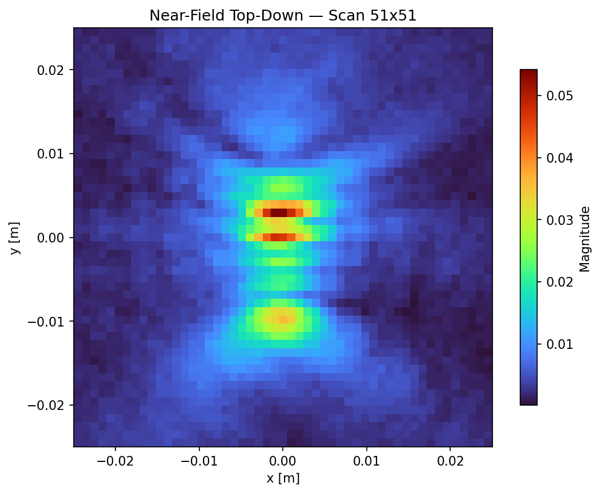
  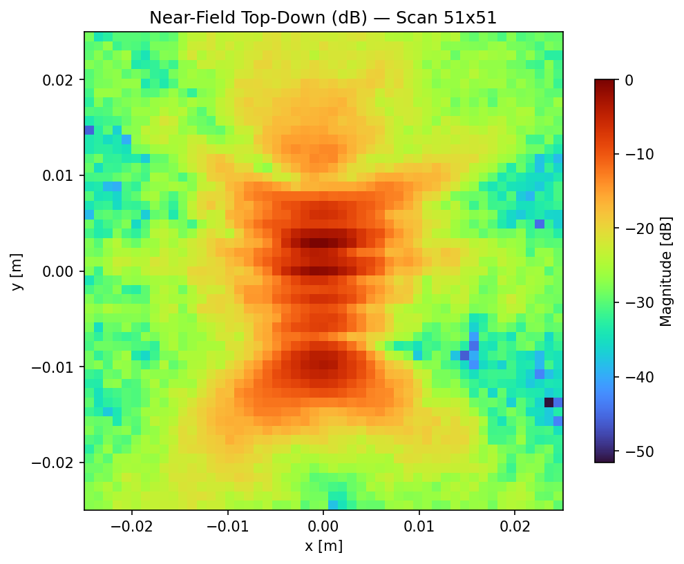
  
  ---

  
  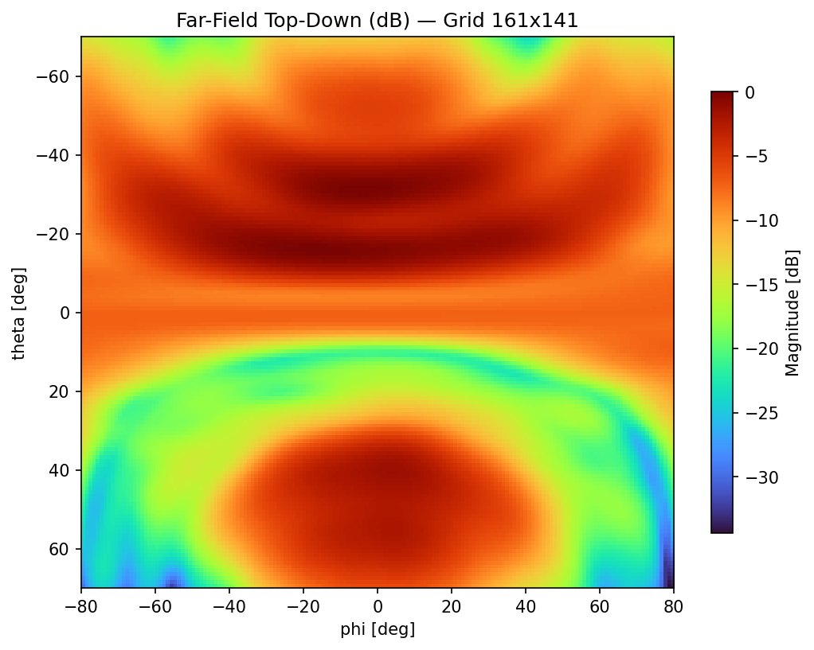
  
  ---


- <span class="md-cite">Conferma ipotesi — Pattern a ~94 GHz</span>
  - Il confronto con il paper allegato conferma che il pattern di radiazione dell’antenna in esame coincide con quello estratto dagli script Python dal dataset a ~94 GHz.
  - Osservazioni principali: lobo principale intorno a `θ ≈ −20°` con `φ ≈ 0°`, larghezze di fascio comparabili e andamento dei sidelobe coerente tra FF misurato e FF calcolato.
  - Implicazione: la pipeline NF→FF implementata in Python riproduce correttamente il comportamento dell’antenna analizzata.
  - Riferimento: `AESA/Design_Sub-THz_SWAA.pdf`.

- Riferimenti
  - Near-Field Scanning Measurements — Scan planare (setup, campionamento, correzioni, incertezze). File: `NF-FF/Near-Field_Scanning_Measurements.pdf`.
  - Error analysis techniques for planar near-field measurements — Analisi degli errori (Newell, 1988, IEEE TAP). File: `NF-FF/Error_analysis_techniques_for_planar_near-field_measurements.pdf`.
  - Measurement of Beamforming Antenna in Transmit Mode (R&S App Note 1MA278). File: `AESA/Measurement_of_Beamforming_Antenna_in_Transmit_Mode_R&S.pdf`.
  - Balanis, "Antenna Theory: Analysis and Design", 4th ed., Wiley, 2016. File: `Teoria/Antenna theory analysis and design, 4th Edition  Constantine A. Balanis. - New York John Wiley & Sons, 2016.pdf - collegamento.lnk`.
  - nf2ff_transformation — Algoritmi NF→FF (Matlab). Link: https://github.com/hbartle/nf2ff_transformation

---

## <span style="color: #e69a44ff;">Settimana 3</span>

- Sviluppo script python di test per comunicazione con stampante 3D Ender 3 e VNA Rohde & Schwarz ZVA 40

- <span class="md-cite">ender3_nf_scanner.py</span>

- Gestione stampante 3D (solo parte meccanica)
  - Obiettivo: controllare l’Ender 3 via G‑code su porta seriale per eseguire una scansione planare sul piano `XZ` con traiettoria a zig‑zag e passo derivato da `λ` della frequenza di lavoro (`compute_params`). Parametri chiave: `port`, `baud`, `serial_timeout`, `bed_x_mm`, `bed_y_mm`, `feedrate`, `dwell_ms`, `aut_ingombro_mm`, `plane` (ender3_nf_scanner.py:63–71).
  - Classe di controllo `GCodePrinter`:
    - Connessione seriale e handshake con il firmware Marlin: apertura porta e drenaggio buffer (`connect`) con lettura posizione `M114` per verifica (ender3_nf_scanner.py:132–147, 189–198).
    - Invio comandi e attesa di conferma: `send`/`wait_ok` gestiscono la risposta `ok`; `query` consente letture come `M114` (ender3_nf_scanner.py:168–209, 173–188).
    - Setup movimento: `G90` (coordinate assolute) e `G21` (unità in mm), con sincronizzazione `M400` per assicurare che i movimenti siano completati prima dell’azione successiva (`setup`) (ender3_nf_scanner.py:210–215).
    - Homing: `G28` per referenziare gli assi, seguito da `M400` (`home`) (ender3_nf_scanner.py:216–220).
    - Movimento puntuale: costruzione di `G1 X.. Y.. Z.. F..` con logging delle coordinate e velocità; `M400` per blocco fino a fine traiettoria (`move`) (ender3_nf_scanner.py:221–240).
  - Pianificazione della scansione `XZ` e traiettoria:
    - Calcolo di `λ`, distanza operativa `y0` e passo `step = λ / (lambda_fraction)`; conversione in mm per pianificare gli incrementi su `Z` (ender3_nf_scanner.py:84–91, 262–271, 319–323).
    - Costruzione delle righe su `X` e delle quote su `Z` con percorso serpentiforme (righe alternate invertite) per minimizzare movimenti a vuoto (ender3_nf_scanner.py:316–330).
    - Limiti meccanici: verifica che `X` sia in `[0, bed_x_mm]` e `Z` in `[0, 180 mm]` prima di ogni comando; i punti fuori limite vengono saltati con messaggio di log (ender3_nf_scanner.py:331–335).
    - Esecuzione punto per punto: movimento `G1` alla coppia `(X, Z)` richiesta alla velocità `F = feedrate`; pausa di stabilizzazione `dwell_ms` per garantire fermo meccanico (ender3_nf_scanner.py:338–340).
    - Ritorno all’origine al termine della scansione per sicurezza (ender3_nf_scanner.py:355–356).
  - Robustezza e diagnosi:
    - Enumerazione porte disponibili e gestione errori di apertura (chiusura di software che occupano la porta consigliata); messaggi di guida in caso di fallimento (`list_available_ports`, eccezioni di `serial`) (ender3_nf_scanner.py:93–99, 140–147).
    - Funzione `get_position` per verifica rapida della posizione attuale via `M114` (utile in fase di setup/debug) (ender3_nf_scanner.py:189–198).

- <span class="md-cite">vna_comm_check.py</span>

- Verifica comunicazione VNA (senza RF)
  - Obiettivo: testare la connessione VISA al VNA (R&S ZVA/ZVB/ZVT), impostare modalità `CW`, frequenza e livelli di potenza per ciascuna porta, mantenendo sempre le uscite RF disattivate per sicurezza (vna_comm_check.py:32–44).
  - Spegnimento sicuro delle uscite: `safe_outputs_off` prova sequenze compatibili di comandi per disattivare la RF su tutte le porte e ignora errori per massima compatibilità tra modelli (vna_comm_check.py:47–64).
  - Impostazione CW e frequenza: `set_cw_frequency` configura lo sweep in `CW` sul Channel 1 e scrive la frequenza richiesta (vna_comm_check.py:66–72).
  - Livelli di potenza per porta: `set_source_power` imposta i livelli senza abilitare RF; mappa di potenze per porta con default e override (porta 1 a −10 dBm di default nel `CONFIG`) (vna_comm_check.py:74–82).
  - Flusso principale: apre risorsa VISA, interroga `*IDN?`, esegue spegnimento, imposta CW/frequenza e potenze, legge i valori impostati (best‑effort), rispegne e chiude la sessione evitando trigger o misure (vna_comm_check.py:84–140).

---

## <span style="color: #e69a44ff;">Settimana 4</span>


- <span class="md-cite">Setup misure</span>

  Il setup per queste prime campagne di misure è molto artigianale ma essenziale per convalidare il codice scritto e avere dei primi risultati qualitativi.

  Il setup consiste, come già sappiamo. da una stampante 3d Ender3 alla quale è stata montata l'antenna sonda (probe), una guida d'onda rettangolare in banda k come mostrato di seguito.

  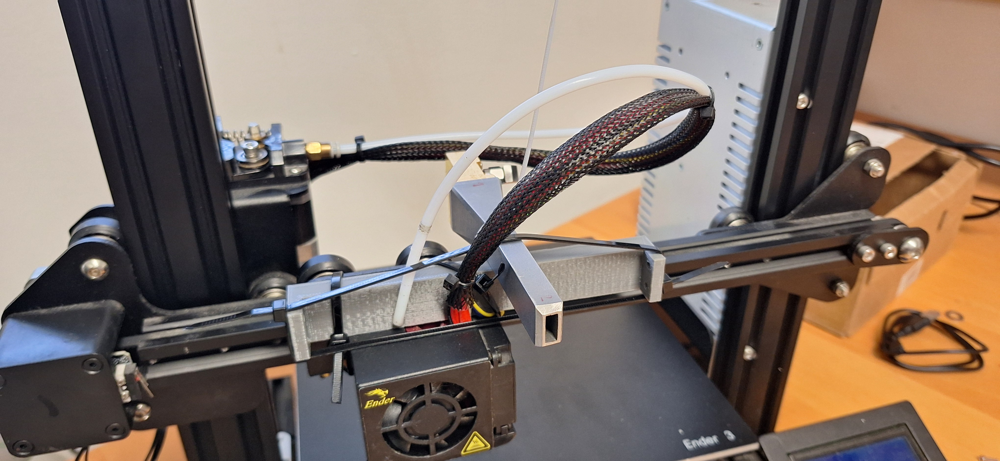

  Come prima AUT è stata scelta un'antenna patch 4x4 a polarizzazione circolare, anch'essa in banda k mostrata nella figura sottostante.

  

  Strumentazione: VNA Rohde & Schwarz ZVA‑40 per l’acquisizione dei parametri S.

  Il set‑up è mostrato nelle immagini seguenti: la AUT è posizionata di fronte al piano di scansione e centrata quanto più possibile.

  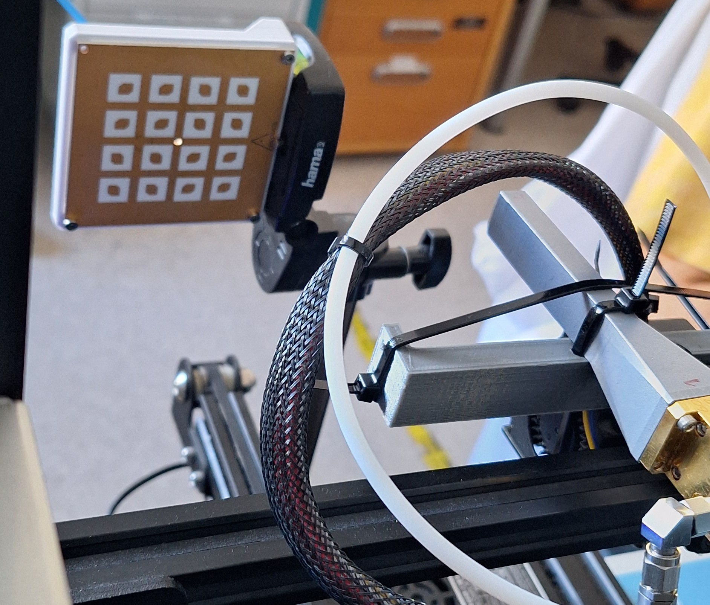
  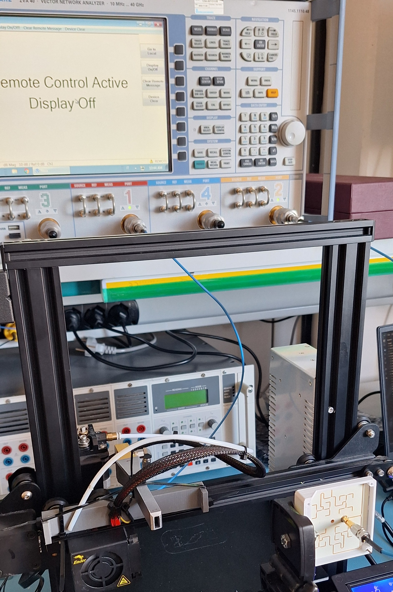

  Le prime misure sono effettuate su una griglia di 180mm x180mm nel piano XZ una distanza di 49mm su uno span che va da 16 a 22 GHz con potenza 0 dBm.

  Per fare il tutto è stato fatto uso di codice python testato la settimana precedente e ottimizzato per automatizzare al meglio le misure ender3_nf_scanner.py.

  Per poter ricostruire il FF dalle misure in NF è necessario ottenere due dataset della stessa AUT, ossia due polarizzazioni indipendenti. Per ottenere ciò è stata ruotata la sonda di 90° essendo a polarizzazione lineare.

Del codice parleremo e approfondiremo nella sezione successiva dedicata
  Automazione: script Python dedicato (`ender3_nf_scanner.py`), testato e ottimizzato per sequenze di misura ripetibili. Ulteriori dettagli e spiegazioni del codice nella sezione successiva.


- <span class="md-cite">ender3_nf_scanner</span>
  Script di automazione che orchestra la scansione NF planare con la Ender‑3 e il VNA ZVA‑40, pilotando gli assi X/Z e lo sweep di misura. Opera sul piano `xz` (con Y=0 fisso) e usa un passo spaziale impostato come `Δ = λ / lambda_fraction`, sovrascrivibile da riga di comando. L’area utile del piano è pari a 180 × 180 mm; la distanza di lavoro `y0` è un parametro che viene passato via CLI a script python successivi.

  I movimenti sono regolati da `feedrate` e `dwell_ms`, con connessione seriale configurabile (`port`, `baud`, `serial_timeout`). Il VNA è gestito via LAN VISA (`vna_address`, `vna_timeout_s`) e lo sweep di misura viene definito in banda tramite `start/stop`, `points`, `IFBW` e `power_dBm`. La campagna abilita la lista dei parametri S `{S11, S21, S12, S22}`; al termine i file `.s2p` vengono scaricati automaticamente nella cartella `outdir`, organizzati per polarizzazione (`outdir/co` e `outdir/cx`) con naming posizionale `sparams_X…_Y…_Z…` (coordinate in mm).

  Per ottenere le due polarizzazioni indipendenti si eseguono due campagne consecutive: prima la “co”, con la sonda lineare nella sua orientazione di riferimento; poi la “cx”, ruotando la sonda di 90°. In pratica si avvia lo script specificando l’opzione `--pol co`, quindi si ripete con `--pol cx` mantenendo gli stessi parametri di sweep e di scansione. Per come è costruito il sistema per ora eseguire l'operazione di ruotare la sonda induce una componente di errore particolarmente importante (a volte distruttiva) che si propaga per tutta la trasformazione fino al FF.

  La durata della misura dipende dalla densità di griglia (`λ / lambda_fraction`), dal numero di punti dello sweep (`points`), dall’IF bandwidth (`IFBW`) e dal tempo di stabilizzazione (`dwell_ms`). Prima di avviare la campagna, assicurarsi che `pyserial` e `pyvisa` siano installati e che `port` e `vna_address` siano correttamente impostati in base al setup.

  Questa prima campagna di misure ha una griglia spaziata di `λ/4` che corrispondono a poco più di 3 mm, quindi per una scansione si impiegano circa 10/15 minuti.

  Di seguito viene lasciato un breve video per mostrare alcuni secondi di una misura in NF.

  <video src="texture/settimana_4/20251111_114337.mp4" controls width="480"></video>


- <span class="md-cite">plot_sparams_field</span>
  Questo script è stato concepito per una validazione visiva dei dati acquisiti, utile a verificare la qualità delle misure e a farsi un’idea del campo irradiato dalla AUT prima della trasformazione NF→FF. A partire dai file `.s2p` della campagna, ricostruisce mappe sul piano di scansione `X–Z` aggregando i valori dei parametri S alla frequenza richiesta. Le mappe possono essere visualizzate in dB o in scala lineare, con normalizzazione alla massima ampiezza per evidenziare la struttura del campo; opzionalmente è possibile una resa 3D o la visualizzazione interattiva.

  Le immagini seguenti mostrano due misure a centro banda (18 GHz) per le due polarizzazioni indipendenti. Nella rappresentazione lineare si evidenzia bene come la sonda capti due polarizzazioni diverse, con massimi/spread spaziali differenti. Questi campi, considerati congiuntamente, danno un’indicazione di cosa aspettarsi in FF dopo la trasformazione, e permettono di verificare rapidamente che le misure siano coerenti (assenza di spike anomali, andamento regolare, allineamento della zona di massima).
---
  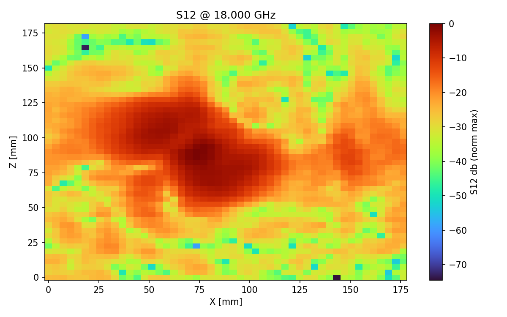
  

---
  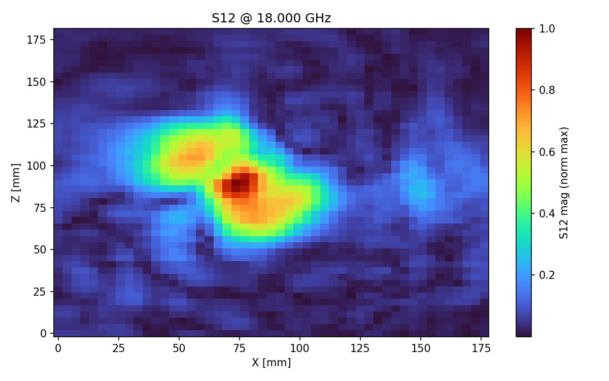
  


- <span class="md-cite">align_co_cx</span>
  Questo script serve a mettere in relazione le due campagne NF di polarizzazione co e cx, stimando l’offset spaziale tra i lobi principali e producendo un confronto visivo. A partire dai file `.s2p` generati durante la scansione (organizzati in `vna_output_file/co` e `vna_output_file/cx`), ricostruisce due mappe sul piano `X–Z` alla frequenza di interesse e le normalizza separatamente: in dB riporta il massimo a 0 dB; in magnitudine porta il massimo a 1.0. In questo modo l’allineamento non è influenzato da eventuali differenze di scala tra le due polarizzazioni.

  Per stimare il punto rappresentativo del lobo, utilizza un baricentro pesato sopra una soglia: in dB considera i punti entro alcuni dB dal massimo (soglia tipica 3–6 dB); in scala lineare considera una frazione del massimo (es. 0.6). Il baricentro così ottenuto per entrambe le polarizzazioni viene confrontato e dalla differenza si ricavano due offset, `Δx` e `Δz` in millimetri, che indicano la traslazione necessaria per sovrapporre la mappa cx alla mappa co.

  L’output include tre elementi utili per la documentazione e l’analisi:
  - Un’immagine “prima” con le due mappe affiancate, ciascuna normalizzata secondo la scelta dB/mag, per valutare forma e posizione dei lobi.

  
  
  - Un’immagine “dopo” con overlay: la mappa cx viene traslata di `Δx, Δz` e sovrapposta alla co con una trasparenza regolabile.

  

  - Un file JSON con gli offset stimati e i metadati della sessione (parametro S, tipo di valore, frequenza, soglie, percorsi), per riuso in script successivi.

  ``` json
  {
    "param": "S12",
    "value": "db",
    "freq_ghz": 18.0,
    "dx_mm": 6.796572984598399,
    "dz_mm": -3.31772632294296,
    "threshold_db": 3.0,
  }
  ```
  Lo scopo pratico è duplice: verificare rapidamente la coerenza spaziale tra le due polarizzazioni e disporre di una misura quantitativa dell’offset che può essere impiegata quando si combinano i campi per stime di FF o per controlli di qualità. In presenza di errori di rotazione/meccanici tra campagne, gli offset tendono ad aumentare e l’overlay aiuta a visualizzare la discrepanza.

  Questo script è stato concepito per essere provvisorio, in quando una volta raffinato il sistema di misura non sarà necessario applicare alcun affset tra le misure, ma vista l'alta incertezza che vi è con questa configurazione risulta necesario avere questo confronto.
  Si noti che i risultati `Δx` e `Δz` non vengono sempre utilizzati, poichè se applicati senza un corretto giudizio portano a una sovrapposizione dei campi errata, argomento che verrà affrontato nella prossima sezione.

 - <span class="md-cite">total_field_co_cx</span>
   Script di combinazione che ricostruisce il campo totale sul piano di misura a partire dalle due campagne co e cx alla frequenza di interesse. Per ogni punto sulla griglia, somma le componenti complesse oppure combina in potenza (modalità selezionabile) e produce sia il modulo totale normalizzato, sia la fase del campo risultante. Può applicare automaticamente la traslazione `Δx, Δz` stimata dal paragrafo precedente (allineamento co↔cx), così da ridurre gli errori introdotti dalla rotazione/meccanica tra campagne.
   Come accennato in precedenza, l'applicazione degli offset proposti dallo script `align_cp_cx.py` va fatta congiudizio, in quanto potrebbero portare a risultati insensati in FF. In particolare se l'offset proposto è un sotttomultiplo di `λ` come nell'esempio del `json` riportato in precedenza.

   La pipeline è pensata per la successiva trasformazione NF→FF: dopo avere centrato l’apertura e resampled la misura su una griglia rettangolare uniforme, esporta un CSV conforme alla convenzione del trasformatore in cui il piano misurato `X–Z` viene mappato sul piano `X–Y` (con `Y = Z_misura`) e la coordinata `Z` è fissata a `Y0` costante.

   Modalità di combinazione:
   - "somma complessa" (`complex_sum`): somma vettoriale `Ex + Ey` e fase derivata dalla risultante; modulo dal vettore complesso.
   - "somma di potenze" (`power_sum`, predefinita): combina i moduli `|Ex|` e `|Ey|` come `sqrt(|Ex|^2 + |Ey|^2)` e usa la fase della somma complessa solo per il plot di fase.

   Output generati in `total/nf_total`:
   - CSV uniforme: `nf_total_uniform_<param>_<freq>GHz[_pc]_pol12.csv` con colonne `X,Y,Z,ExReal,ExImg,EyReal,EyImg,EzReal,EzImg` (coordinate in metri, piano `XY` con `Z=Y0`).

   ``` csv
    X,Y,Z,ExReal,ExImg,EyReal,EyImg,EzReal,EzImg
    -0.0899377374,-0.0899377374,0.049,0.00497789821,0.00364549551,0.000212607396,0.00210900395,0,0
    -0.0849411964,-0.0899377374,0.049,0.00334905786,0.00541681144,-0.000461695105,0.00255890936,0,0
    -0.0799446555,-0.0899377374,0.049,0.0020931433,0.00614348147,-0.000535078696,0.00297143171,0,0
    -0.0749481145,-0.0899377374,0.049,0.0031572734,0.00443550432,-0.00294306898,0.00293445284,0,0
    ...
    ...
   ```
   - Modulo totale lineare e in dB normalizzati.

   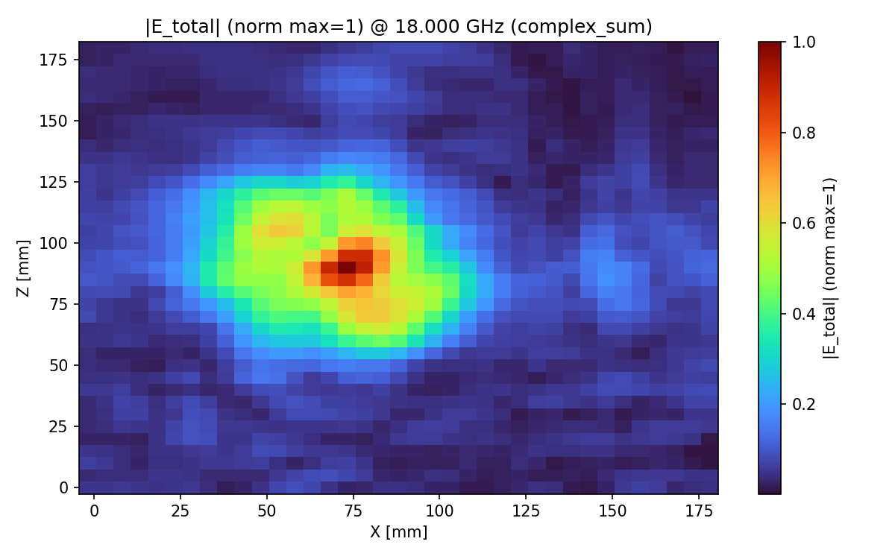  
   

   In pratica, questo passaggio consente di ottenere un dataset coerente e direttamente impiegabile per la trasformazione, riducendo l’impatto delle differenze tra le due polarizzazioni e rendendo più trasparente la qualità del campo totale misurato.

   In questo script è stata anche aggiunta la possibilità di applicare la probe correction. Ciò è stato implementato assumento che la guida d’onda rettangolare lavori in modo `TE₁₀`. Il campo di apertura viene rappresentato come una distribuzione sinusoidale lungo il lato largo `a = 10.55 mm` e uniforme lungo il lato stretto `b = 4.25 mm`. Questo si traduce in fattori di risposta `Hx`,`Hy` calcolati con integrali sinusoidali e funzioni sinc, che descrivono il pattern della sonda nei due assi spaziali.

   Passando alla probe correction, il codice calcola la FFT dei campi misurati `(Ex, Ey)`, divide nel dominio spaziale‑frequenza per la risposta teorica della probe `(Hx,Hy)`, e poi fa l’iFFT per tornare ai campi corretti. In pratica rimuove l’effetto del pattern della sonda, riportando i dati a quelli che si avrebbero con una sonda ideale.


- <span class="md-cite">run_nf2ff_from_csv</span>
   Questo script prende il CSV NF uniforme generato in precedenza (campo totale co+cx ricampionato su griglia regolare) e calcola il Far Field con la trasformazione planare basata su FFT. Per prima cosa individua automaticamente il file giusto in funzione della frequenza e del parametro S, poi stima la copertura angolare massima utilizzabile con un criterio geometrico, considerando l’estensione del piano di misura e la distanza `z0` impostata nel CSV.

   La trasformazione costruisce una griglia angolare simmetrica attorno a `0°` con risoluzione circa `1°` e applica padding/finestra 2D come configurato. Gli assi sono coerenti con la convenzione adottata: `φ` è l’elevazione verso `x` con zero parallelo a `z+`, mentre `θ` è l'elevazione rispetto a `z`. Per ridurre artefatti ai bordi, è possibile indicare dei margini da sottrarre ai limiti geometrici prima del calcolo.

   L’output include i prodotti necessari per analisi e report:
   - Mappe FF 2D normalizzate: scala lineare con max=1, e in dB mormalizzato a 0.

    
   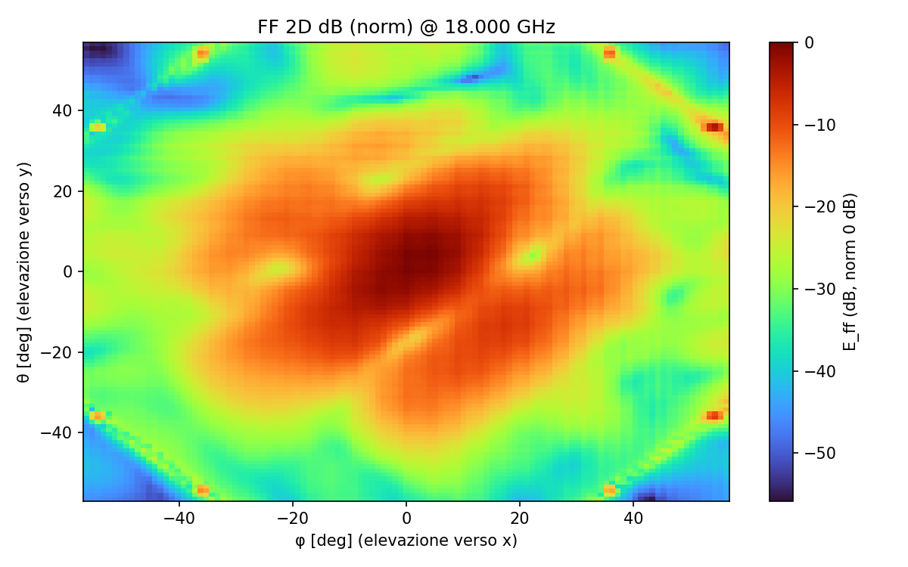   
   
   - Tagli 1D in dB con i profili `φ` @ `θ=0°` e `θ` @ `φ=0°`.

    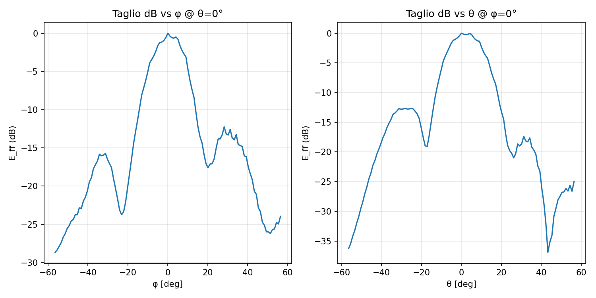

   - Visualizzazione 3D opzionale (PyVista): superfici 3D del FF in lin/dB.

   Questo passaggio chiude la catena NF→FF: partendo dal CSV uniforme del campo totale, si ottiene la mappa angolare normalizzata del campo lontano insieme ai tagli principali e ai dati tabellari per ulteriori confronti o post‑elaborazioni.

- <span class="md-cite">ff_compare_cuts</span>
   Il prende i dati di far‑field calcolati, sia nella versione grezza sia con probe correction, e li mette a confronto con le misure reali. Per farlo, individua i file CSV corrispondenti alla frequenza e al parametro scelto, e carica anche i file di misura in formato testo. Una volta raccolti i dati, seleziona i due tagli principali del diagramma di radiazione: quello lungo `θ` con `φ=0°` e quello lungo `φ` con `θ=0°`. Tutti i valori vengono normalizzati rispetto al massimo, così da avere un confronto coerente.  

  Il programma poi cerca di allineare i lobi principali dei tre dataset, spostando leggermente gli assi angolari per far coincidere i massimi entro una soglia di `6 dB`. A questo punto genera due grafici: uno per il taglio in `φ` e uno per il taglio in `θ`, dove si vedono sovrapposti i pattern calcolati senza correzione, con correzione e quelli misurati.

  

  Nell'immagine si nota come la probe correction abbia impatto solo ad angoli superiori di `40°`, ciò a senso poichè l'Half Power Beamwidth `(HPBW)` del nostro probe corrisponde a 

  Infine, interpola i dati simulati sui punti di misura e calcola la differenza in dB tra simulazione e misura. Produce quindi un secondo set di grafici che mostra l’errore residuo lungo i due tagli principali. In sostanza, il codice serve a visualizzare e quantificare quanto la probe correction avvicini il far‑field calcolato al comportamento reale dell’antenna.

  

  ---

## <span style="color: #e69a44ff;">Settimana 5</span>

- <span class="md-cite">Effetto della Distanza Probe-AUT sui Parametri S11/S22</span>

Nell'ambito delle misure in NF, la sonda di misura (probe) viene posizionata a distanza ravvicinata rispetto all’AUT, consentendo l’acquisizione del campo elettromagnetico su una superficie di scansione (planare, cilindrica o sferica). Tuttavia, la prossimità tra probe e AUT introduce fenomeni di accoppiamento mutuo e carico della sonda (probe loading), che possono influenzare sensibilmente i parametri di riflessione S11 e S22, ovvero i coefficienti di riflessione alle porte di ingresso e uscita del sistema di misura.

1. Durante misure near-field con distanza ravvicinata tra AUT e sonda, i parametri S11 e S22 possono variare sensibilmente.
2. Se l’obiettivo è la ricostruzione del far-field, le variazioni di S11/S22 non sono critiche purché la sonda sia coerente e calibrata.
3. Se invece si vuole caratterizzare l’impedenza della AUT, la presenza ravvicinata della sonda falsifica la misura.

Verranno inoltre approfonditi: l’effetto della distanza probe-AUT in configurazioni planari, il ruolo delle sonde OEWG (Open-Ended Waveguide), le tecniche di compensazione e calibrazione, la teoria dell’accoppiamento mutuo e le implicazioni pratiche per la progettazione e l’esecuzione delle misure.

- **Effetto della Distanza Probe-AUT sui  Parametri di Riflessione: Conferme Sperimentali e Teoriche**

  Numerosi studi sperimentali e simulativi confermano che la distanza tra probe e AUT influisce in modo significativo sui parametri di riflessione S11 e S22. Ad esempio, in misure di permittività tramite probe coassiali open-ended, è stato dimostrato che la riflessione misurata (S11) varia drasticamente al variare della distanza tra la sonda e il materiale sotto test (MUT). In particolare:

  - **Studi su probe coassiali in mezzi stratificati** mostrano che la riflessione S11 è estremamente sensibile alla distanza tra la sonda e l’interfaccia di un secondo strato (AUT). Errori di stima della permittività superiori al 70% sono stati riscontrati ignorando la presenza del secondo strato a distanze inferiori a 0.1 mm, mentre l’errore si riduce a meno del 2% includendo un modello a due strati.
  - **Simulazioni e misure su sonde OEWG** mostrano che la presenza di materiali dielettrici, assorbitori o variazioni geometriche nella zona di accoppiamento modifica S11 anche di diversi dB, con impatti significativi sulle prestazioni della sonda e sulla misura.


  Dal punto di vista teorico, la variazione di S11/S22 con la distanza probe-AUT è spiegata dal fenomeno dell’accoppiamento mutuo, descritto tramite matrici di impedenza (Z-matrix) e S-matrix. Quando la sonda si avvicina all’AUT, si instaurano correnti indotte e campi reattivi che alterano l’impedenza vista dalla porta di misura, modificando i parametri di riflessione.

  - **La mutual coupling theory** mostra che la presenza di elementi radianti vicini (sonda e AUT) introduce termini di impedenza mutua che dipendono fortemente dalla distanza e dalla configurazione geometrica.
  - **Simulazioni numeriche (MoM, FEM, FDTD)** confermano che la variazione della distanza modifica la matrice di impedenza e, di conseguenza, i parametri S misurati.
  - **Studi su array di antenne** evidenziano che la riduzione della distanza tra elementi porta a una diminuzione del determinante della matrice di impedenza, con rischi di singolarità e instabilità nella misura.

- Ricostruzione del Far-Field: Robustezza alle Variazioni di S11/S22

  Una delle domande chiave riguarda la criticità delle variazioni di S11/S22 per la ricostruzione del far-field tramite trasformazione NF-FF. Numerose fonti autorevoli confermano che, **purché la sonda sia coerente e calibrata**, le variazioni locali di S11/S22 non compromettono la qualità della ricostruzione del campo lontano:

  - **Costanzo & Di Massa (InTechOpen, 2011)** dimostrano sperimentalmente che la trasformazione NF-FF (sia planare che cilindrica) restituisce pattern di radiazione accurati anche in presenza di variazioni di fase e ampiezza dovute alla prossimità della sonda, a condizione che la sonda sia correttamente calibrata e il sistema sia coerente.
  - **Migliore (MDPI Electronics, 2018)** afferma esplicitamente:  
  > "Le variazioni di S11/S22 non sono critiche per la ricostruzione del far-field se la sonda è coerente e calibrata. Tali variazioni possono essere mitigate tramite tecniche di filtraggio e compensazione, e non compromettono la qualità della trasformazione NF-FF."
  - **Francis et al. (NIST, 1994)** mostrano che, anche in presenza di riflessioni multiple tra probe e AUT, la ricostruzione del far-field tramite algoritmi di compensazione della sonda (probe correction) rimane accurata fino a livelli di sidelobe inferiori a -55 dB rispetto al main beam.
  - **Leach & Paris (IEEE, 1973)** e **Wang (IEEE, 1988)**, citati come riferimenti fondamentali, confermano che la compensazione della sonda (tramite modelli teorici e misure di calibrazione) permette di eliminare l’effetto delle variazioni locali di S11/S22 sulla trasformazione NF-FF.
  - **Rohde & Schwarz (AppNote 1MA304)** e **MVG** nelle loro note tecniche ribadiscono che la calibrazione della sonda e la compensazione software sono sufficienti a garantire la correttezza della misura in campo lontano, anche in presenza di variazioni locali di riflessione.

- Analisi Numerica e Metodi di Compensazione

  Le tecniche numeriche di compensazione della sonda (probe correction) sono ormai standard in tutti i principali software di trasformazione NF-FF (AMS32, NSI-MI, MVG, ecc.). Queste tecniche includono:

  - **Compensazione di primo ordine**: adatta per sonde OEWG e horn simmetrici, corregge l’effetto della risposta angolare della sonda.
  - **Compensazione di ordine arbitrario**: necessaria per sonde non ideali o a banda larga, permette di correggere anche effetti di cross-polarizzazione e asimmetrie del pattern.
  - **Deconvoluzione e pesatura tramite pattern della sonda**: la risposta della sonda viene utilizzata come funzione di pesatura nell’integrale di trasformazione, eliminando l’effetto del probe loading.

  **Risultato chiave**:  
*La robustezza della trasformazione NF-FF rispetto alle variazioni di S11/S22 è stata dimostrata sia teoricamente (teorema di reciprocità di Lorentz, pattern multiplication) sia sperimentalmente, purché la sonda sia coerente e calibrata*.

- Caratterizzazione d’Impedenza dell’AUT: Criticità della Prossimità della Sonda

  Quando l’obiettivo della misura è la caratterizzazione dell’impedenza dell’AUT (ad esempio, la misura precisa di S11 per determinare l’adattamento o la permittività di un materiale), la presenza ravvicinata della sonda introduce errori significativi:

  - **Studi su probe coassiali open-ended** mostrano che la presenza di strati multipli o la variazione della distanza tra probe e AUT altera drasticamente la misura della riflessione, rendendo la stima dell’impedenza o della permittività non affidabile se non si tiene conto dell’effetto di carico della sonda.
  - **Analisi teoriche** dimostrano che la riflessione misurata dalla sonda è funzione della distanza, della permittività e della geometria del sistema, e che la presenza di accoppiamento mutuo e campi reattivi falsifica la misura dell’impedenza reale dell’AUT.

- Linee Guida e Standard

  Le linee guida IEC, IEEE e CISPR raccomandano esplicitamente di minimizzare l’effetto di carico della sonda durante la caratterizzazione d’impedenza, suggerendo l’uso di modelli di correzione, la calibrazione su materiali di riferimento e la scelta di distanze di misura tali da ridurre l’accoppiamento mutuo.

  **Nota tecnica**:  
  *La IEC 61967-6 specifica procedure di calibrazione per sonde magnetiche e coassiali, sottolineando la necessità di tenere conto della distanza e della geometria della sonda per ottenere misure affidabili di impedenza e campo*.

- Misure Near-Field Planari: Impatto della Distanza e della Sonda

  Le misure planari sono particolarmente sensibili all’effetto della distanza probe-AUT, soprattutto per antenne direttive e sonde OEWG. Le principali fonti confermano che:

  - **La risoluzione spaziale e la precisione della misura dipendono dalla distanza di scansione**: distanze troppo ridotte aumentano il carico della sonda e l’accoppiamento mutuo, mentre distanze troppo elevate riducono la sensibilità e la risoluzione.
  - **La compensazione della sonda è essenziale**: la risposta angolare e la polarizzazione della sonda devono essere note e compensate per ottenere una trasformazione NF-FF accurata.
  - **Le sonde OEWG sono preferite per la loro risposta quasi omnidirezionale e la facilità di modellizzazione**, ma richiedono comunque una calibrazione accurata e la correzione degli effetti di carico.

- Sonde OEWG e Simili: Caratteristiche, Pattern e Effetto sul Carico dell’AUT

  Le sonde OEWG (Open-Ended Waveguide) sono ampiamente utilizzate nelle misure near-field per la loro semplicità costruttiva, la risposta ben modellabile e la bassa cross-polarizzazione. Tuttavia:

  - **La geometria della sonda (apertura, taper, presenza di assorbitori o dielettrici)** influisce su S11 e sul pattern di radiazione, modificando il carico visto dall’AUT.
  - **L’aggiunta di assorbitori può migliorare la SCS (Scattering Cross Section) senza penalizzare S11, purché mantenuti a distanza >0.2λ dall’apertura**.
  - **La presenza di dielettrici o modifiche geometriche può peggiorare S11 e introdurre riflessioni indesiderate**, richiedendo ottimizzazione congiunta di taper e materiali.
  - **La risposta della sonda deve essere caratterizzata e compensata tramite modelli teorici o misure di calibrazione**, soprattutto per pattern complessi o misure a banda larga.


- Studi Numerici e Simulazioni: Valutazione dell’Effetto della Sonda sull’AUT

  Le simulazioni numeriche (MoM, FEM, FDTD) sono strumenti essenziali per valutare l’effetto della sonda sull’AUT e ottimizzare la configurazione di misura:

  - **Simulazioni FDTD** mostrano che la posizione della superficie di integrazione (equivalente alla distanza probe-AUT) influisce sulla ricostruzione del far-field solo se non si applicano tecniche di media geometrica o compensazione, confermando la robustezza della trasformazione NF-FF se la sonda è calibrata.
  - **Studi su probe per nanoscopia THz** evidenziano che la geometria e la distanza della sonda determinano il livello di accoppiamento e la risoluzione spaziale, con effetti diretti su S11/S22 e sulla qualità della misura.
  - **Analisi di array di antenne** confermano che la mutual coupling e la variazione della distanza tra elementi (inclusa la sonda) modificano il pattern di radiazione e l’impedenza attiva, richiedendo l’uso di embedded element patterns per una modellizzazione accurata.

- Quando S11/S22 Non Sono Critici (NF-FF)

  - **Obiettivo: Ricostruzione del far-field**  
  Se la misura serve a ricostruire il pattern di radiazione in campo lontano, le variazioni locali di S11/S22 dovute alla prossimità della sonda non sono critiche, purché:
    - La sonda sia coerente (stabile in ampiezza e fase) e calibrata.
    - Si applichino tecniche di compensazione della sonda (probe correction).
    - Si operi in ambiente controllato (camera anecoica, assorbitori adeguati).
    - Si verifichi la coerenza tra le misure di ampiezza e fase su tutte le polarizzazioni.

- Conclusioni

  L’analisi approfondita della letteratura scientifica, delle note tecniche industriali e degli standard internazionali conferma inequivocabilmente che:

  - La distanza tra probe e AUT influisce sensibilmente sui parametri di riflessione S11/S22 nelle misure near-field, a causa di accoppiamento mutuo e carico della sonda.
  - Per la ricostruzione del far-field, le variazioni di S11/S22 non sono critiche se la sonda è coerente e calibrata, grazie alle tecniche di compensazione e calibrazione oggi disponibili.
  - Per la caratterizzazione d’impedenza dell’AUT, la presenza ravvicinata della sonda falsifica la misura, rendendo necessarie tecniche di de-embedding, modelli a più strati e calibrazione accurata.
  - Le sonde OEWG e simili, pur essendo preferite per la loro risposta modellabile, richiedono comunque una caratterizzazione accurata e una compensazione software per garantire l’affidabilità delle misure.
  - Le linee guida operative raccomandano di scegliere la distanza probe-AUT in funzione dell’obiettivo della misura, applicando sempre tecniche di calibrazione e compensazione appropriate.

- <span class="md-cite">Campagne misure e problemi/errori riscontrati</span>
  
  Sono state eseguite diverse campagne di misure in near-field con distanza probe-AUT variata, si va a confermare quanto riportato nella sezione precedente dove si afferma che la distanza tra probe e AUT non influisce nella ricostruzione del campo lontano, purché la sonda sia coerente e calibrata.

  A convalida di ciò ci sono state fatte misure a distanza di 15mm, 31mm, 49mm (risultati già riportati nel capitolo della settimana 4) e a 120mm.
  A distanze minime, a differenza di come ci si aspettava, si ha una migliore ricostruzione del campo FF, grazie anche a un'ampiezza angolare risultante maggiore rispetto a misure con distanza maggiore.
  Ciò accade poichè a distanze superiori subentrano molto presto gli errori di troncamento ai bordi della griglia planare, che influiscono sulla ricostruzione del campo FF.
  Di seguito vengono lasciati due plot che evidenziano questo problema.

  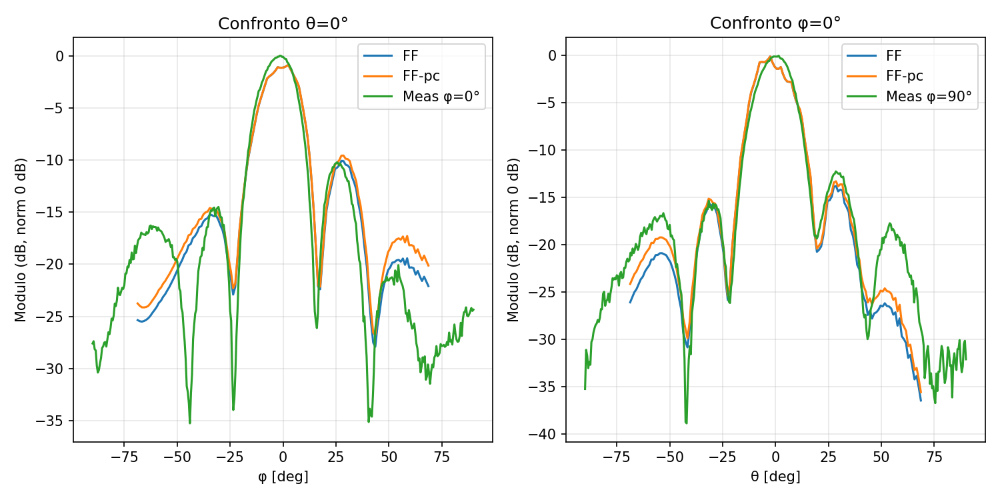
  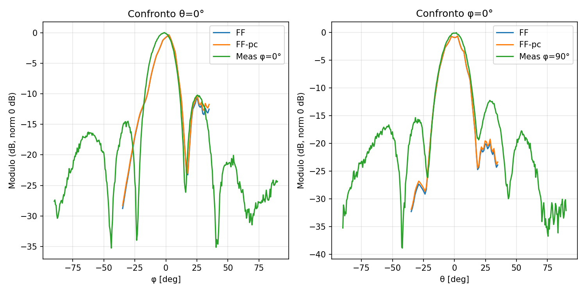

  È facile notare come gli errori di troncamento si manifestino inn entrambi i casi e rovinino la ricostruzione del campo FF.
  In particolare, a distanza di 120mm, l’ampiezza angolare risultante è circa la metà rispetto a misure con distanza di 31mm, questo quindi implica una ricostruzione del campo peggiore rispetto a misure a distanza ravvicinata.

- <span class="md-cite">Misure a distanza 15mm</span>

  Nella speranza di ottenere risultati più accurati e una risoluzione angolare più ampia è stata eseguita una campagna di misure a distanza estremamente ravvicinata. Questo ha portato ad avere dati in NF che spaziano da -80° a +80° e risultati interessanti nel campo catturato.
  Più precisamente, vista la natura della AUT (patch 4x4 a polarizzazione circolare con 4 sub-array) è stato possibile visualizzare come i diversi elementi radianti si comportano a frequenze differenti.

  Di seguito vengono illustrati alcuni plot che evidenziano questo comportamento.

  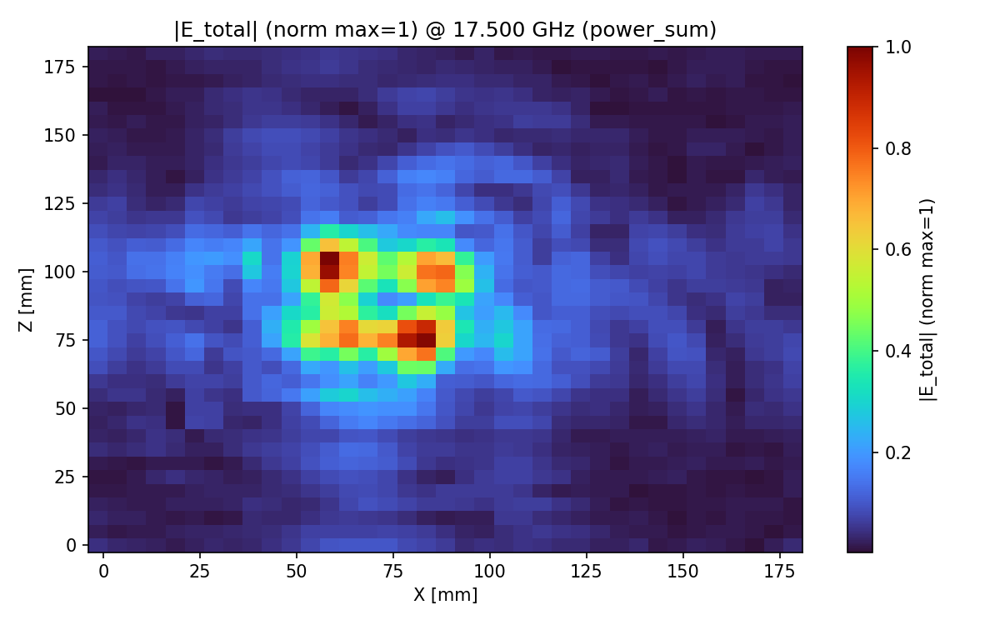
  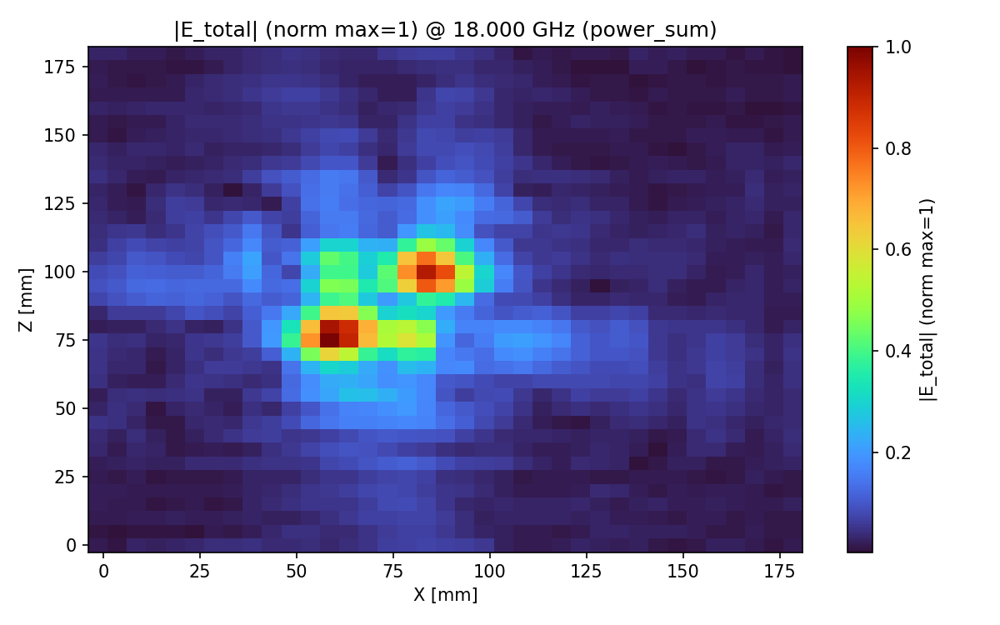
  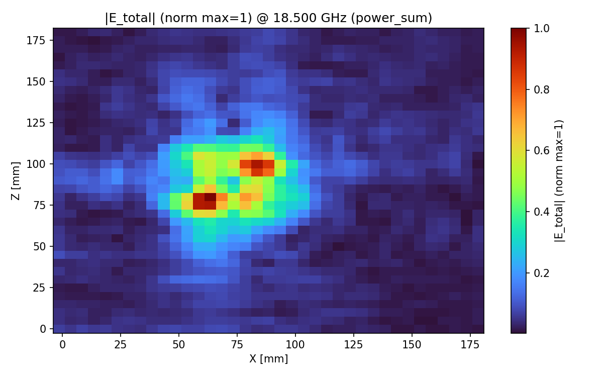
  
  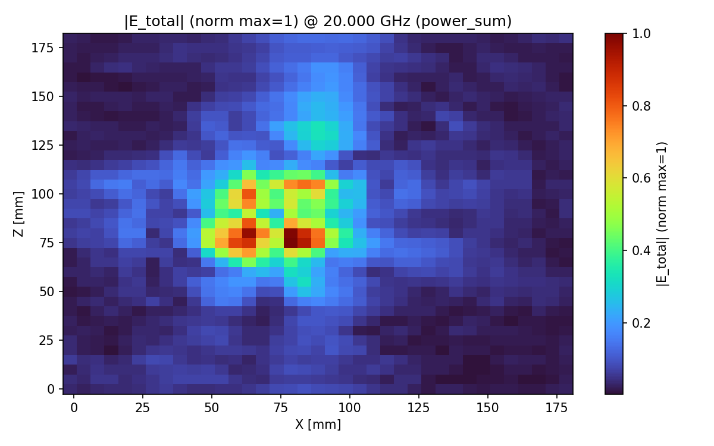


  Purtroppo per quanto riguarda la ricostruzione del FF non si ottengono risultati più accurati, al contrario si è costretti a tagliare più risoluzione angolare a causa del sistema artigianale di misura il quale porta con se errori per niente trascurabili.

- <span class="md-cite">CST: familiarizzazaione e riproduzione probe utilizzata</span>

  La seconda parte della settimana è stata impiegata per familiarizzare con il software di simulazioni elettromagnetiche CST (Computer Simulation Technology) e riprodurre la probe utilizzata per le misure. Per rendere il processo più veloce è stato fatto utilizzo di video su YouTube che illustrano le principali funzionalità del software linkati di seguito.

  - [CST Studio How to Build A S1E1: Waveguide Horn](https://www.youtube.com/watch?v=zH8cJe9zppc&t=1523s)

  Il risultato ottenuto è illustrato nella seguente immagine.

  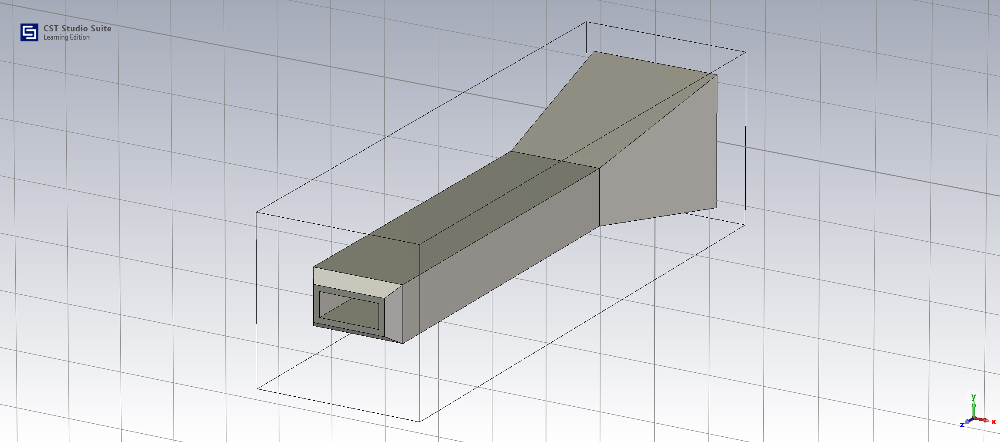

  Quindi il Far Field è stato misurato per ottenere una rappresentazione del pattern di radiazione utile ad avere ulteriore conferme nei risultati ottenuti nelle trasformazioni delle scorse settimane, soprattutto per quanto riguarda la probe correction. I plot 3D e dei tagli principali del campo sono illustrati nelle figure seguenti.

  

  ---

  
  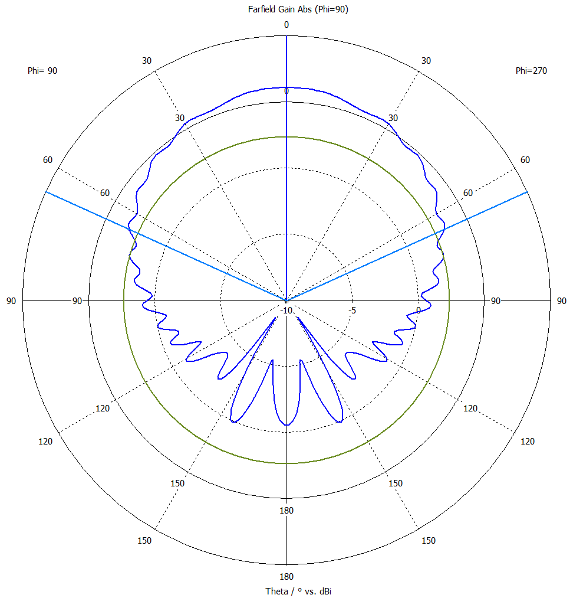

  Successivamente questi risultati verranno esportati e integrati nella tradformazione NF-FF per ottenere una probe correction più veritiera e rappresentativa del sistema reale utilizzato.

  Per acquisire ulteriori capacità con CST si è deciso di modellare anche la transizione guida-cavo per ottenere una rappresentazione più accurata del sistema reale utilizzato. La trasnsizione utilizzata è la QWA-42S29F00, la quale purtroppo non risulta avere datasheet pubblici circa il suo return-loss (S11). Nonostante tutto si è deciso di proseguire e sono stati sfruttati video YouTube anche in questo caso.
  
  - [CST Studio How to Build A S1E3: Waveguide to Coax Adapter](https://www.youtube.com/watch?v=VQVC3bJbp98&t=1153s)
  - [Design of a Ku Band Waveguide to coaxial line transition with Ansys HFSS 3D modeling](https://www.youtube.com/watch?v=UsYN-9vemWM&t=1737s)
  
  I risultati delle simulazioni del S11 risultano ottimi (probabilmente troppo, quindi poco realistici) e vengono riportati di seguito dopo il alcuni rendere 3D della transizione modellata.

  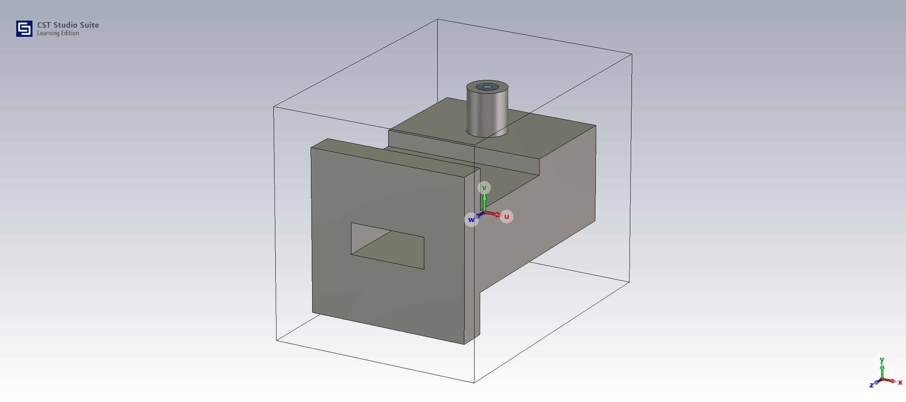

  ---

  
  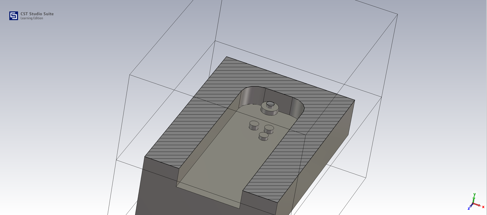

  ---

  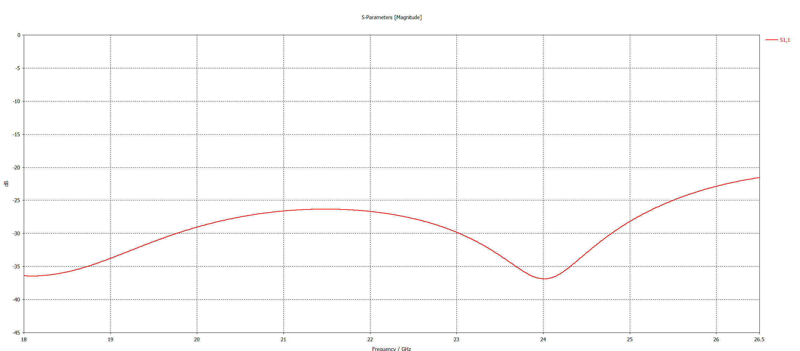


- Riferimenti

  - [Costanzo & Di Massa, InTechOpen 2011](http://www.intechopen.com/books/numerical-simulations-of-physical-and-engineering-processes/advanced-numerical-techniques-for-near-field-antenna-measurements)
  - [Migliore, MDPI Electronics 2018](https://doi.org/10.3390/electronics7100257)
  - [Francis et al., NIST 1994](https://doi.org/10.6028/jres.099.012)
  - [Aksoy et al., AMTA 2021](https://www.emcturkiye.org/papers/Session5_Talk2.pdf)
  - [Rohde & Schwarz, AppNote 1MA304](http://www.rohde-schwarz.com/appnote/1MA304)
  - [Asilian Bidgoli et al., ResearchGate 2024](https://www.researchgate.net/publication/380988387_A_Simplified_Formulation_of_the_Reflection_Coefficient_of_an_Open-Ended_Coaxial_Probe_in_Multilayered_Media)
  - [IEC 61967-6:2002](https://webstore.iec.ch/en/publication/6193)
  - [SpringerLink, Near-Field Antenna Measurement Techniques](https://link.springer.com/rwe/10.1007/978-981-4560-44-3_117)

## <span style="color: #e69a44ff;">Settimana 6</span>

- <span class="md-cite">CST: Simulazione completa probe + transizione</span>

  Dopo aver disegnato e simulato la probe (OEWG) e la transizione guida-cavo (QWA-42S29F00) in maniera indipendente, si è deciso di simulare il sistema completo per ottenere una rappresentazione più accurata del sistema reale utilizzato.
  Quindi sono stati uniti i componenti e ottenuti i risultati del FF e Return Loss (S11).

  

  Di seguito vengono riportati i plot del parametro S11 misurati dal VNA e quelli simulati. È importante notare che i valori differiscono sia per la misura reale che non è stata effettuata in un ambiente privo di riflessioni e che il sistema simulato non è una esatta riproduzione dei compponenti reali in quanto per la transizione guida d'onda non erano disponibili datasheet o modelli.

  
  

  L'andamento dei due grafici risulta comunque simile e apprezzabile, seguiranno simulazioni e/o misure più accurate per ottenere una migliore rappresentazione del sistema reale utilizzato.

  Come accennato è stato simulato ed eestrapolato il FF della probe simulata che verrà utilizzato nella probe correction durante la trasformazione NF-FF. Qui sotto sono riportati i due tagli `φ=0` e `φ=90`.

  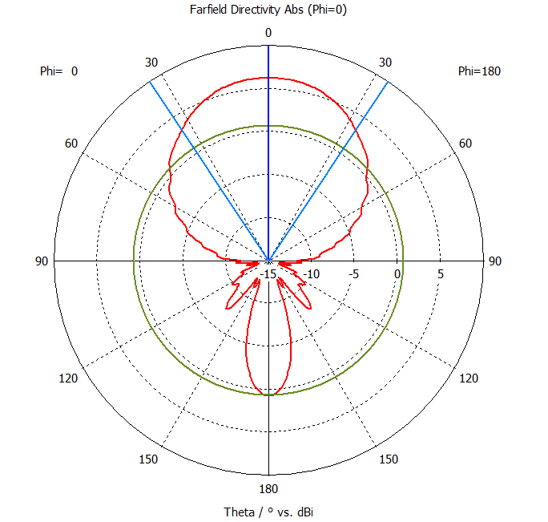
  

## <span style="color: #e69a44ff;">Settimana 7</span>

- <span class="md-cite">Risoluzione problemi sul bordo del FF trasformato</span>

  Durante questa settimana si è affrontato il problema di risolvere i problemi presenti sul bordo del FF trasformato. In particolare si è notato che per la campagna di misure svolta a distanza estremamente ravvicinata (14mm) si è verificato un comportamento anomalo del FF trasformato.
  In particolare si è notato come vicino al bordo del campo in FF trasformato si generasse uno spike che superava anche il lobo centrale.
  Oltre a questo problema, si è presentato anche un ulteriore artefatto, la creazione di "diagonali" ad alto guadagno nella trasformazione in FF, ovviamente non presenti nelle misure NF.
  Di seguito vengono riporti i plot con evidenziato questi comportamenti: cerchiato di rosso lo spike e di verde le "diagonali".

  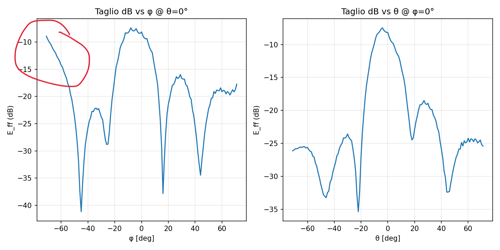

  ---

  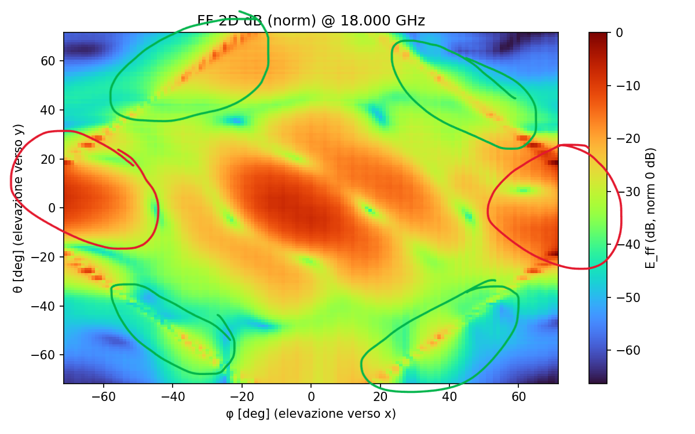

  Si è deciso di cominciare col cercare di capire a cosa fosse dovuto lo spike. Conoscendo il sistema di misura implementato, si è subito pensato che potrebbe essere dovuto a riflessioni sul cavalletto utilizzato per sistenere la AUT, più precisamente di una vite che sporge proprio nella stessa posizione dello spike indicato. Se ciò fosse vero si dovrebbe trovare conferma anche nelle misure in NF.
  Indagando i dati raccolti si nota che è presente una lieve riflessione (cerchiata in viola) al di fuori della regione del lobo centrale (cerchiata in grigio).
  
  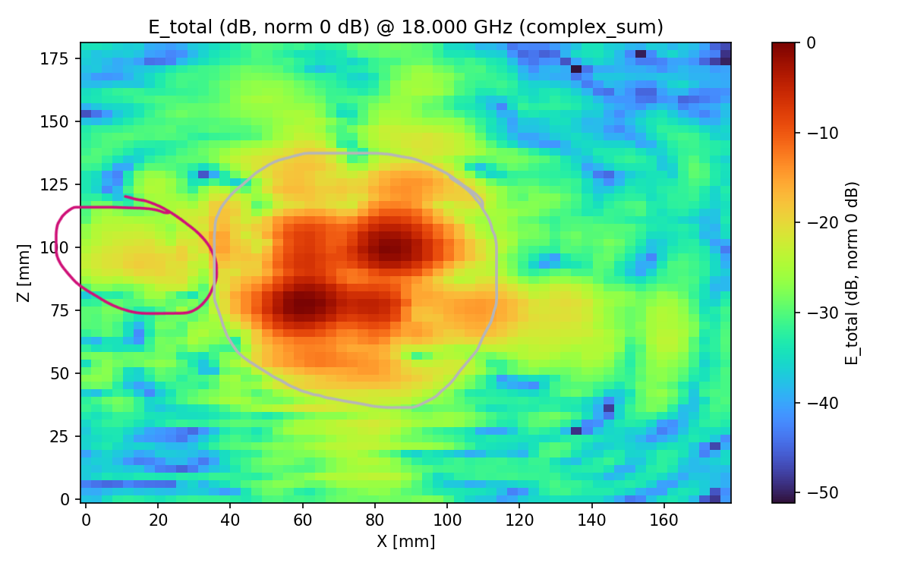

  Per avere ulteriore conferma di questa ipotesi, si è andato a investigare altre campagne di misure a distanze più lontane (31mm e 49mm). In queste campagne si è notato che lo spike non è presente, confermando così l'ipotesi iniziale. Vengono riportati i tagli del FF come prova visiva.

  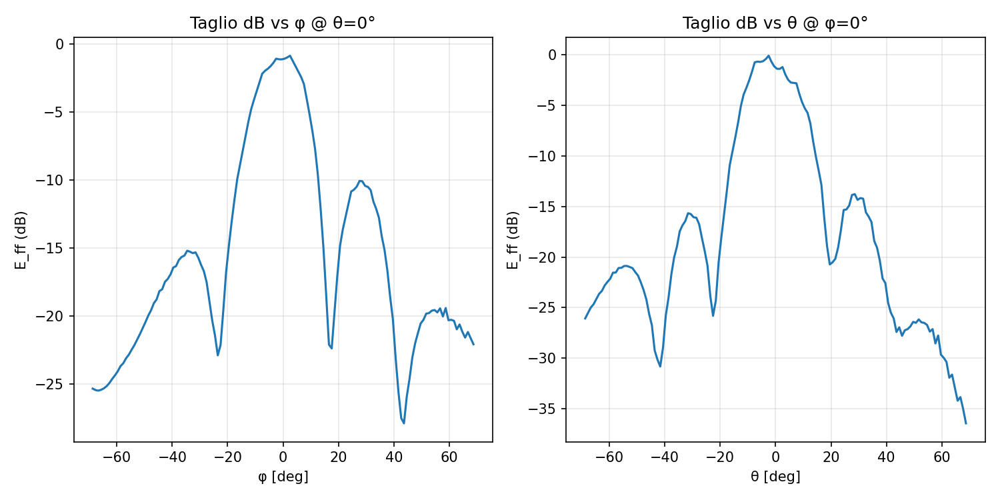
  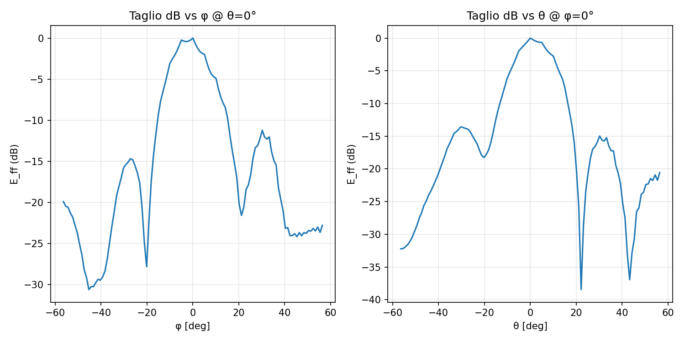

  ---

  Successivamente si è passati a risolvere il problema delle "diagonani", problema che non si presenta nelle misure in NF, questo sta a indicare che è un problema che si genera nella trsformazione NF-FF.
  Analizzando il problema più a fondo, queste "diagonali" non erano presenti nelle trasformazioni NF-FF quando era stato utilizzato il primo dataset a 94GHz, ancora ad inizio esperienza.
  Si è prodotto a confrontare le differenze tra i due script di trasformazione, poichè erano stati adattati per lavorare con dataset diversi e si è scoperto che il problema delle "diagonali" è funzione di un errata definizione del vettore d'onda in coordinate sferiche.

  Per semplicità di manipolazione dei dati si era deciso di utilizzare una convenzione differente per gli angoli `θ` e `φ`, il che portava ad ottenere `kx ∝ sin(φ)` e `ky ∝ sin(θ)` che rompeva la correlazione angolare `√(kx²+ky²) ≠ k0·sin(θ)`, distorcendo l'angolo polare effettivo e introducendo artefatti.
  Si è subito sistemato il problema reintroducendo la corretta mappatura sferica dei numeri d'onda, quindi eliminando le "diagonali" presenti nei plot del FF.
  DI seguito si possono apprezzare i nuovi risultati, che per quanto riguarda il lobo principare non subiscono variazioni, ma ai bordi non presentano più artefatti.

  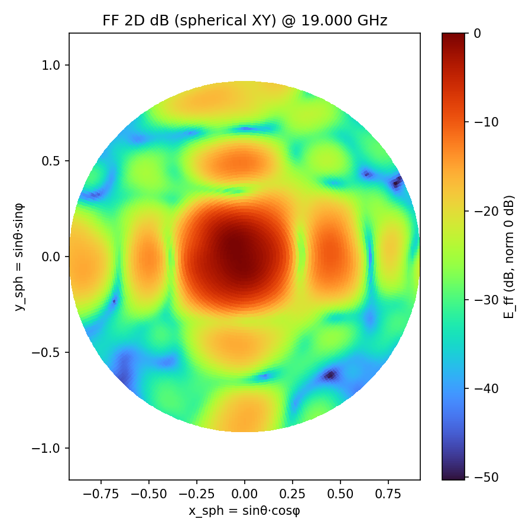


- <span class="md-cite">Probe correction dai dati estratti in cst</span>

  Dopo aver concluso la modellaziione del sistema probe OEWG e transizione guida d'onda, sono state eseguite le simulazioni del campo irradiato e quindi esportati i dati dello stesso in file `.txt` a diverse frequenze. 
  L'idea iniziale era quella di manipolare questi dati estratti e darli in pasto al codice già presente che esegue la probe correction analitica, ciò ha generato non pochi problemi e soprattutto risultati completamente errati e insensati.
  Viene riportato di seguito uno dei tanti kernel di trasformazione utilizzati per la probe correction che venivano computati.
  
  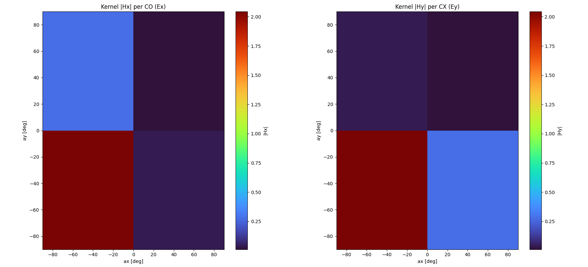
  
  Si è quindi deciso di adottare un approccio differente, realizzare uno script ad hoc che implementava la probe correction dai dati estratti dal software CST.
  Come prima cosa si è proceduto a verificare che i dati estratti corrispondessero con le simulazioni presenti in CST e che venissero interpretati correttamente all'interno dello script, si sono quindi realizzati molteplici plot del varie componenti del campo.
  Di seguito viene riporato il plot di modulo e fase delle componenti `Eθ` e `Eφ`, che corrisponde con quanto simulato in CST.

  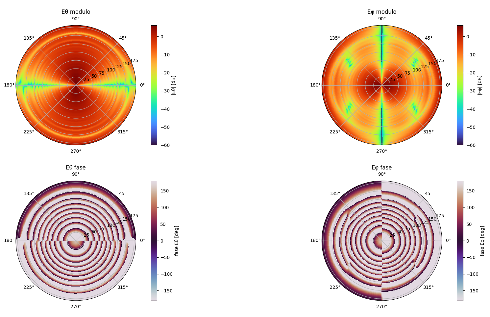

  Poi è stato verificato che il computo delle componenti `Ex` e `Ey` dal campo `Eθ` e `Eφ` corrisponde con quanto simulato in CST.
  Vengono riportati di seguito i plot di modulo e fase delle componenti `Ex` e `Ey`, che corrisponde con quanto simulato in CST.

  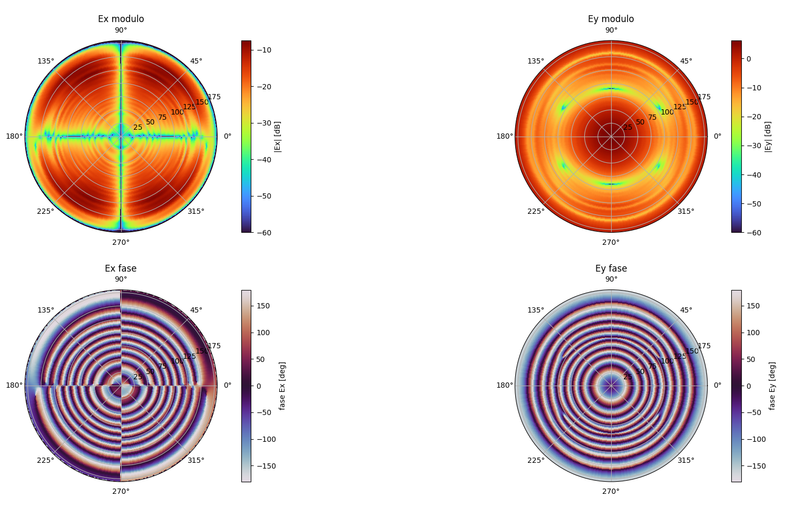

  Confermato anche il corretto calcolo delle componenti `Ex` e `Ey` dal campo `Eθ` e `Eφ`, si è passati finalmente alla computazione della risposta `H(kx, ky)` e della sua pseudo inversa, direttamente utile alla probe correction.
  Come in precedenza è stato eseguito il plot dei vari passaggi, di seguito viene riportato direttamente il kernel invertito, l'obbiettivo è verificare che abbia una risposta continua e omogenea, visibilmente simile al pattern del campo irradiato dalla probe.

  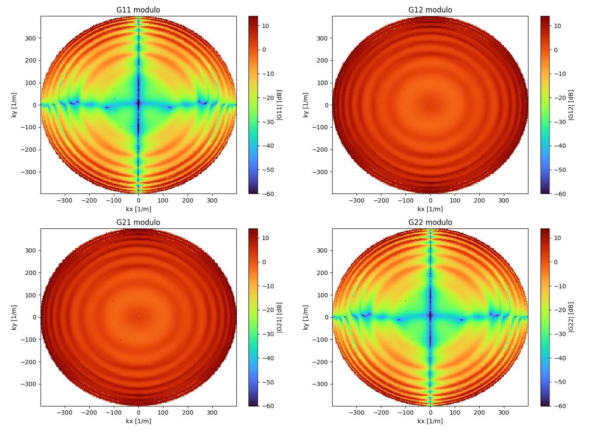

  Infine, ottenuto il NF corretto è stato applicata la stessa routine per le precedenti trasformazioni e calcolato il compare dei tagli `φ=0` e `φ=90` con le altre trasformazioni e i dati reali.
  Seguono i confronti delle differenti trasformazioni rispettivamente a 18, 18.5 e 19 GHz.

  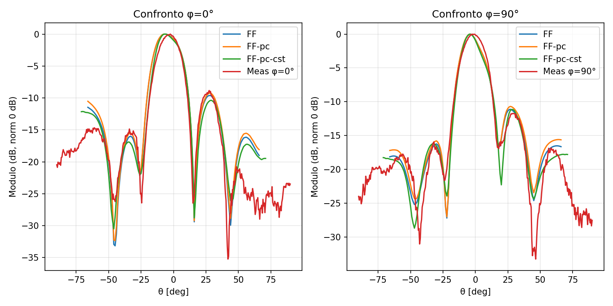
  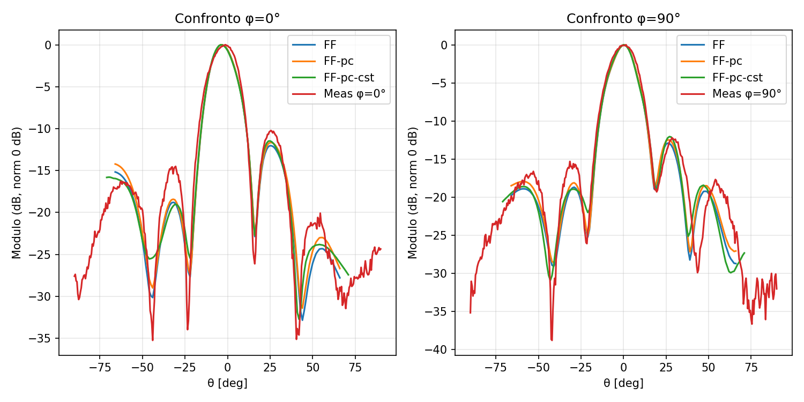
  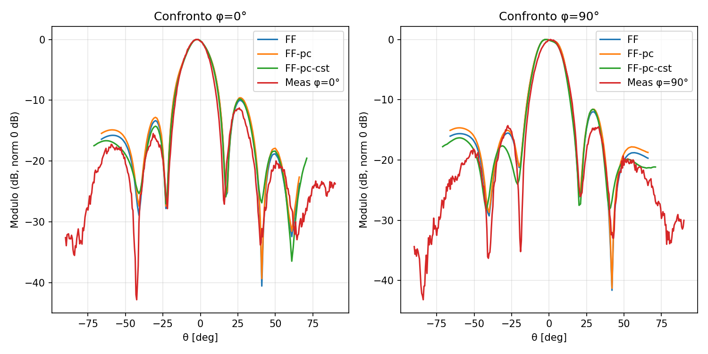

- <span class="md-cite">cst_probe_correction.py</span>

  Per completezzezza si va a spiegare in maniera concettuale quello che esegue lo script

    Modello nel dominio tangenziale `k_t = (kx, ky)`:

    - Misura: `V(kx, ky) = H(kx, ky) · E(kx, ky)`
    - Correzione: `E(kx, ky) = G(kx, ky) · V(kx, ky)` con `G ≈ H⁺`
    - Pseudoinversa regolarizzata: `G = (Hᴴ H + α I)⁻¹ Hᴴ`

    Dove:
    - `H(kx, ky)` è il kernel della probe (2×2) ottenuto dai pattern far‑field CST, mappati in `Ex,Ey` sul piano e campionati su `kx,ky`.
    - `α` è la regolarizzazione (Tikhonov) per stabilizzare l’inversione.

    Dominio valido e attenuazioni realistiche:
    - Disco fisico: `k_t² ≤ k₀²` (`k₀ = 2π f / c`). Fuori dal disco, il kernel è non propagante.
    - Taglio geometrico opzionale: `θ_max` dalla distanza `z0` limita a `k_t ≤ k₀ · sin(θ_max)`.
    - Smorzamento ai bordi: limitazione del modulo di `G` (`gmin ≤ |G| ≤ gmax`) e blending con identità: `G_blend = (1−β) I + β · G_clamped`.

    Procedura operativa:
    1) Dal file CST FF (`Eθ,Eφ`) si calcolano `Ex,Ey` sul piano per ciascuna coppia di angoli; si costruisce `H(kx,ky)` su griglia regolare.
    2) Si interpola/filla `H` solo dentro il disco `k_t ≤ k₀` e si applica il taglio geometrico se necessario.
    3) Si calcola la pseudoinversa `G` con regolarizzazione `α`, quindi clamping del modulo (`gmin,gmax`) e blending `β`.
    4) Si trasformano le misure NF co/cx in `V(kx,ky)` e si applica `E = G · V`.
    5) Inversa FFT → `Ex(x,z), Ey(x,z)` corrette; si normalizza e si esporta il CSV (`X,Y,Z,ExReal,ExImg,EyReal,EyImg,…`) con coordinate in metri.

    Parametri tipici (script):
    - `--pinv-alpha` (regolarizzazione): più alto → correzione più morbida.
    - `--pinv-gmin`, `--pinv-gmax` (clamping): limitano azione ai bordi.
    - `--pinv-beta` (blending): 0 → identità, 1 → correzione piena.
    - `--dist` (distanza `z0`): imposta `θ_max` e attenua naturalmente i bordi.

- <span class="md-cite">An Effective Aperture Field Reconstruction Method Based on the SWE-to-PWE Technique</span>

  - Obiettivo: ricostruire il campo sull’apertura (extreme near-field) partendo da misure NF sferiche, tramite trasformazione `SWE → PWE` e IFT sul piano.
  - Metodologia: calcolo dei coefficienti SWE dai dati NF sferici, conversione in spettro di onde piane (PWE), recupero parziale della regione “invisibile” e trasformata di Fourier inversa per ottenere i campi sul piano dell’apertura.
  - Punti chiave: risoluzione spaziale superiore al limite classico di λ/2 dell’IFT su far-field, uso di regolarizzazione/filtri per stabilizzare lo spettro, attenzione a rumore e troncamento.
  - Validazione: dimostra accuratezza nella diagnostica (identificazione difetti, disallineamenti) tramite mappe di campo su aperture note.
  - Implicazioni per NF planare: le regole di campionamento spettrale e la gestione del troncamento/finestre sono trasferibili; per scan planari servono correzione di sonda, passo ≤ λ/2 e apodizzazione per mitigare ringing.

- <span class="md-cite">Application of the SWE-to-PWE Antenna Diagnostics Technique to an Offset Reflector Antenna</span>

  - Obiettivo: validare sperimentalmente la diagnostica SWE→PWE su un riflettore offset reale introducendo volutamente tilt del feed e distorsioni superficiali.
  - Metodologia: misura NF sferica, `SWE → PWE`, ricostruzione del campo in prossimità dell’apertura e confronto con far-field per evidenziare gli errori.
  - Risultati: le anomalie introdotte sono rilevate nelle mappe di campo sull’apertura e correlate alle degradazioni nel pattern; la tecnica mostra sensibilità a errori di allineamento e di superficie.
  - Considerazioni pratiche: accuratezza dipende da qualità della misura (rumore, posizionamento, correzione di sonda) e dall’estensione della sfera di misura.
  - Implicazioni per NF planare: utili indicazioni su come leggere difetti reali nell’apertura; per setup planari valgono analoghe precauzioni di accuratezza e copertura spettrale.

- <span class="md-cite">SWE-TO-PWE ANTENNA DIAGNOSTICS (influenza dell’accuratezza di misura)</span>
  - Obiettivo: analizzare l’influenza di accuratezza finita della misura sulla trasformazione `SWE → PWE` e sulla ricostruzione del campo di apertura.
  - Metodologia: studio simulato di rumore, troncamento, errori di sonda e non idealità; valutazione di quanto spettro PWE nella regione visibile (e parte dell’invisibile) sia recuperabile.
  - Risultati: raccomandazioni su campionamento e filtraggio; mostra come certe non idealità degradino la ricostruzione e suggerisce strategie di mitigazione (finestratura, regolarizzazione, calibrazione).
  - Implicazioni per NF planare: linee guida direttamente applicabili (passo, finestratura, correzione di sonda); con scan finiti si introduce convoluzione e leakage spettrale, da trattare con opportune finestre.

- <span class="md-cite">An aperture back-projection technique and measurements made on a flat plate array with a spherical near-field arch</span>

    - Obiettivo: ricostruire il campo sull’apertura di un array planare a partire da misure NF sferiche usando una tecnica di back‑projection.
    - Metodologia: proiezione all’indietro del campo misurato sulla superficie d’apertura tramite funzione di Green/sorgenti equivalenti (Huygens), includendo correzione di sonda e normalizzazione di fase.
    - Punti chiave: gestione del troncamento dell’arco sferico con finestre e zero‑padding; controllo del contributo evanescente; verifica sperimentale su flat‑plate array.
    - Implicazioni per NF planare: la stessa idea di back‑propagation si traduce nel dominio planare come trasformazione inversa dello spettro di onde piane con filtri stabilizzanti e correzione di sonda accurata.

- <span class="md-cite">Reduction of Truncation Errors in Planar Near-Field Aperture Antenna Measurements Using the Gerchberg-Papoulis Algorithm</span>

    - Obiettivo: ridurre gli errori da troncamento delle misure NF planari (griglia finita) ricostruendo le parti mancanti del campo di apertura.
    - Metodologia: algoritmo iterativo Gerchberg‑Papoulis che alterna vincoli di supporto nel dominio spaziale e banda limitata nel dominio spettrale (`k_t`), con aggiornamento coerente di ampiezza e fase.
    - Parametri: numero di iterazioni, peso dei vincoli, scelta di finestre e soglie; attenzione alla sensibilità al rumore e alla stabilità.
    - Risultati: riduzione di ripple nel FF, sidelobes più bassi e miglior fedeltà del campo di apertura rispetto a semplici finestre; utile quando l’area di scansione non copre sufficientemente l’apertura.
    - Linee pratiche: partire da dati corretti di sonda, usare apodizzazione moderata, fermare l’iterazione quando l’errore RMS si stabilizza; validare su antenne standard.

- <span class="md-cite">The backward transform of the near field for reconstruction of aperture fields</span>

    - Obiettivo: ottenere il campo sull’apertura direttamente dalle misure NF planari via trasformazione all’indietro nel dominio dello spettro di onde piane.
    - Metodologia: calcolo dello spettro `E(kx, ky, z0)` e retro‑propagazione al piano dell’apertura con il fattore `exp(+j kz · z0)`; ricostruzione delle componenti tangenziali `Ex, Ey` e mappa di ampiezza/fase.
    - Stabilità: i termini evanescenti crescono nella retro‑propagazione → necessaria regolarizzazione/filtraggio su `k_t` (clamping, Tikhonov) e apodizzazione per contenere il rumore.
    - Campionamento: passi ≤ `λ/2`, distanza `z0` non troppo grande per mantenere componenti utili; griglia estesa oltre il contorno dell’AUT per limitare troncamento.
    - Operatività: integrare probe correction prima della backward transform; usare zero‑padding per migliorare la risoluzione angolare del FF e la qualità della mappa di apertura.

- Riferimenti
    - IEEE Explore — "An Effective Aperture Field Reconstruction Method Based on the SWE-to-PWE Technique"
    - AMTA 2007, TICRA/DTU — “Application of the SWE-to-PWE Antenna Diagnostics Technique to an Offset Reflector Antenna”
    - EUCAP 2006 — “The Influence of Finite Measurement Accuracy on the SWE-to-PWE Antenna Diagnostics Technique” (TICRA/DTU)
    - AMTA — “An aperture back‑projection technique and measurements made on a flat plate array with a spherical near‑field arch”
    - IEEE — “Reduction of Truncation Errors in Planar Near‑Field Aperture Antenna Measurements Using the Gerchberg‑Papoulis Algorithm”
    - IEEE — “The backward transform of the near field for reconstruction of aperture fields”

## <span style="color: #e69a44ff;">Settimana 8</span>

- <span class="md-cite">hbpr.py</span>

    - **Obiettivo**: Ricostruire il campo elettrico complesso (ampiezza e fase) sull'apertura dell'antenna (z=0) partendo da misure Near-Field planari (parametri S), gestendo polarizzazione circolare e correzione degli errori di troncamento.
    - **Flusso Logico**:
        1.  **Caricamento e Parsing**: Lettura massiva di file `.s2p` (VNA) per componenti Co-pol e Cross-pol; estrazione automatica delle coordinate spaziali (X, Z) dai nomi dei file e creazione della griglia di misura.
        2.  **Pre-processing & Constraints**: Verifica automatica dei vincoli di campionamento (Criterio di Nyquist $\Delta < \lambda/2$) e validazione distanza Probe-AUT rispetto al limite del Near-Field Reattivo ($0.62\sqrt{D^3/\lambda}$). Allineamento del centro griglia e applicazione di **Zero Padding** per migliorare la risoluzione nel dominio spettrale.
        3.  **Gerchberg-Papoulis (Opzionale)**: Algoritmo iterativo per la riduzione dell'errore di troncamento (scan area limitata). Alterna trasformate FFT/IFFT applicando vincoli noti: i dati misurati all'interno dell'area di scansione e campo nullo all'esterno dell'apertura fisica dell'antenna.
        4.  **Holographic Back Projection (HBPR)**:
            -   Trasformata al dominio dei numeri d'onda (k-space) tramite FFT 2D.
            -   Calcolo del **Propagatore Inverso** per traslare il campo dal piano di misura ($y=d$) al piano dell'apertura ($y=0$).
            -   **Gestione Onde Evanescenti**: Implementazione di filtri per controllare l'amplificazione esponenziale del rumore nella regione evanescente ($k > k_0$). Supporta filtro esponenziale controllato (`beta`) e regolarizzazione di **Tikhonov** (`gamma`) per un'inversione stabile.
        5.  **Filtraggio k-space**: Applicazione di maschera per la Regione Visibile ($k_x^2 + k_z^2 \le k_0^2$) con apodizzazione (taper coseno/Tukey) per ridurre il *Gibbs ringing*, oppure estensione controllata alle evanescenti per super-risoluzione.
        6.  **Ricostruzione Spaziale**: IFFT 2D per ottenere il campo d'apertura complesso.
        7.  **Sharpening & Post-processing**:
            -   **Richardson-Lucy Deconvolution**: Algoritmo iterativo (opzionale) per de-sfocare l'immagine dell'apertura utilizzando la PSF del sistema (determinata dai filtri applicati). Include regolarizzazione **Total Variation (TV)** per sopprimere l'amplificazione del rumore nelle zone uniformi.
            -   Trasformazione di polarizzazione: Calcolo componenti RHCP e LHCP da Co/Cx lineari.
    - **Parametri CLI Principali**:
        -   Input: `--freq-ghz`, `--y0-mm` (distanza), `--data-dir`, `--cx-dir`.
        -   Geometria: `--aut-dim-x/z-mm`, `--probe-dim-x/z-mm`, `--center-x/z-mm`.
        -   Algoritmo: `--padding-factor`, `--gp-iterations` (Gerchberg-Papoulis).
        -   Regolarizzazione: `--evanescent-beta` (filtro exp), `--tikhonov-gamma` (inversione), `--rl-iterations` (Sharpening), `--rl-tv-reg` (TV noise control).
    
    I parametri ottimali per quanto riguarda la HBR sono:
    - `--padding-factor` = 4
    - `--gp-iterations` = 1
    - `--evanescent-beta` = 1
    - `--tikhonov-gamma` = 2.5e-5
    - `--rl-iterations` = 100
    - `--rl-tv-reg` = 1e-3

    Di seguito vengono riportati dei plot che mostrano il campo sull'apertura della AUT a 17.8 GHz, con distanza Probe-AUT di 54.5 mm; prima senza l'utilizzo dell'algoritmo Gerchberg-Papoulis (GP), poi con una iterazione del GP. Il sistema risulta ancora molto rumoroso in quando non sono ancora presenti materiali e strutture assorbenti, ma i risultati risulatano apprezzabili e coerenti con quanto ci si aspettasse.

    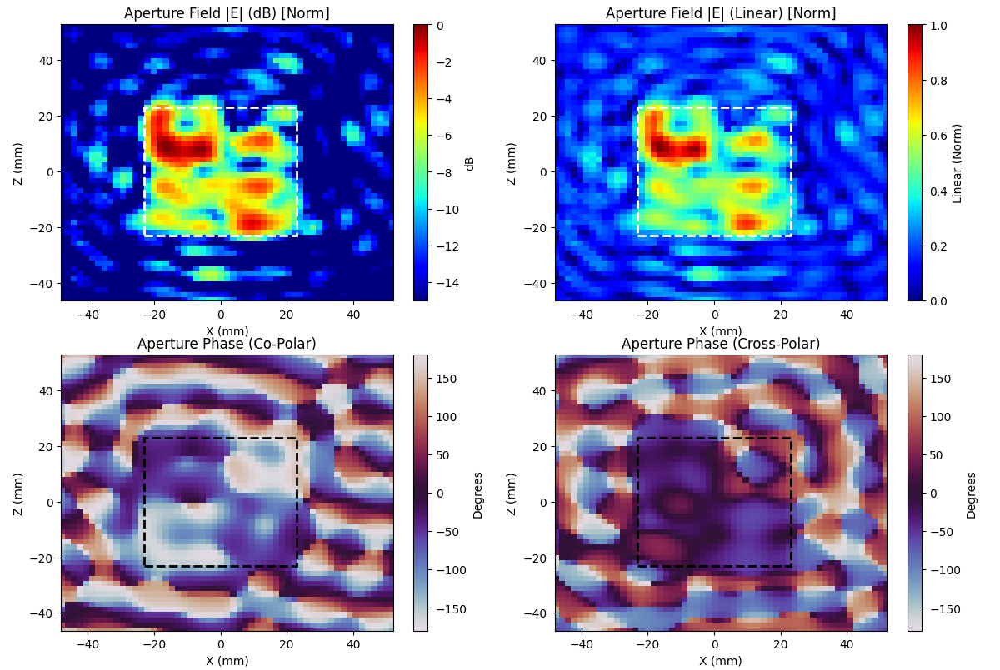
    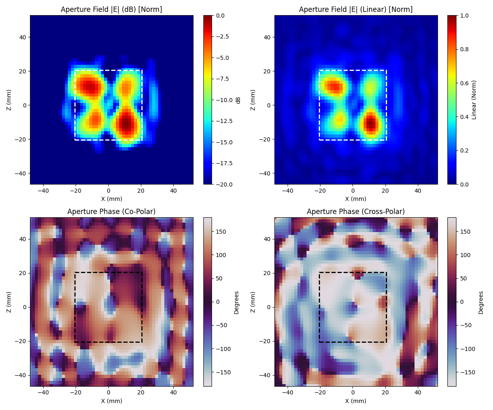

    Si noti che l'area di interesse valida risulta essere solo quella delimitata dalla linea bianca tratetggiata, in quanto il campo elettrico è nullo all'esterno dell'apertura fisica dell'antenna e ciò che si vede nei plot risultano essere solo artefatti dovuti alle trasformate di Fourier e all'area di scansione non infinita.